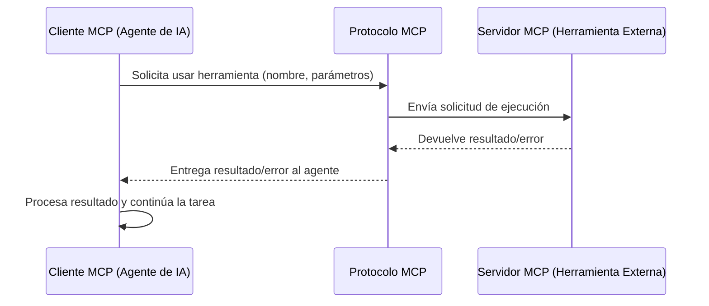

# Cliente MCP

Este documento describe el rol y las características de un Cliente MCP (Model Context Protocol) en el sistema de agentes.

## Definición

Un **Cliente MCP** es una entidad, generalmente un [[Agentes-especializados|agente de IA]] o un [[Modelo de Contexto (MCP)|Modelo de Lenguaje Grande (LLM)]], que inicia solicitudes para interactuar con herramientas o servicios externos a través del [[Modelo de Contexto (MCP)|Protocolo MCP]]. El cliente formula estas solicitudes de manera estructurada, especificando la herramienta a utilizar y los parámetros necesarios.

## Funcionalidades del Cliente MCP

-   **Formulación de Solicitudes**: Construye mensajes MCP que especifican la `tool` a invocar y sus `parameters`.
-   **Interpretación de Respuestas**: Procesa los resultados devueltos por el [[Servidor MCP]], ya sean datos, estados de éxito/error o notificaciones.
-   **Gestión de Contexto**: Mantiene el estado de la conversación y el conocimiento adquirido a través de las interacciones con las herramientas.
-   **Manejo de Errores**: Implementa lógica para gestionar fallos en la ejecución de herramientas o en la comunicación con el servidor.

## Flujo de Interacción

## Importancia en el Proyecto

En nuestro sistema, los agentes de [[OpenCode]] actúan como Clientes MCP, permitiéndoles:

-   Acceder a [[Herramientas del Sistema|herramientas del sistema]] como `read`, `write`, `bash`.
-   Cargar [[Skills|Skills]] especializadas que extienden sus capacidades.
-   Interactuar con servicios externos configurados a través de MCP (ej. [[Cloudflare R2]], [[Sentry]]).

## Relación con Otros Conceptos

- [[Modelo de Contexto (MCP)]]
- [[Servidor MCP]]
- [[Agentes-especializados]]
- [[Skills]]
- [[Herramientas del Sistema]]

> [!note] Documento creado como placeholder.
> *Última actualización: 2026-04-27*