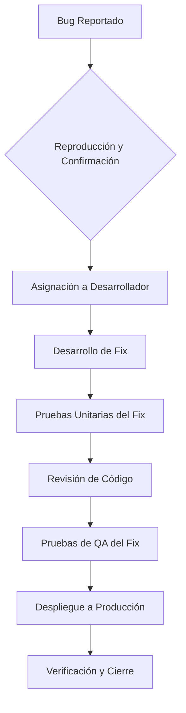
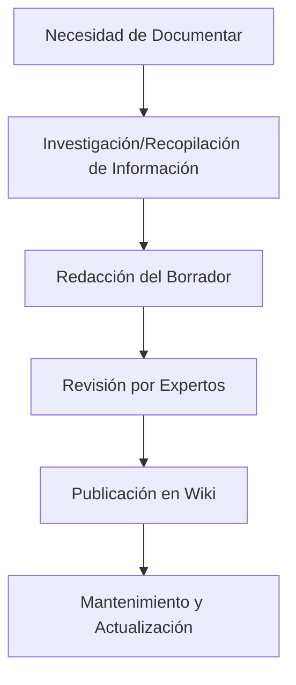

# Flujos de Trabajo

Este documento describe los flujos de trabajo estandarizados utilizados en el proyecto para diversas tareas de desarrollo y gestión.

## Definición

Un **Flujo de Trabajo** es una secuencia de pasos o actividades interconectadas que se realizan para completar una tarea o lograr un objetivo específico. En el contexto de desarrollo de software, los flujos de trabajo definen cómo se mueven las tareas desde su inicio hasta su finalización, involucrando a diferentes roles y herramientas.

## Importancia

-   **Consistencia**: Asegura que las tareas se realicen de manera uniforme, reduciendo errores y variaciones.
-   **Eficiencia**: Optimiza la secuencia de actividades, eliminando pasos innecesarios y cuellos de botella.
-   **Claridad**: Proporciona una comprensión clara de las responsabilidades y expectativas para cada miembro del equipo.
-   **Calidad**: Contribuye a la entrega de productos de mayor calidad al integrar revisiones y validaciones en cada etapa.
-   **Onboarding**: Facilita la incorporación de nuevos miembros al proporcionar guías claras sobre cómo operar.

## Ejemplos de Flujos de Trabajo en el Proyecto

### 1. Flujo de Desarrollo de una Nueva Funcionalidad

```mermaid
graph TD
    A[Idea/Requisito] --> B{Análisis y Diseño}
    B --> C[Desarrollo de Código]
    C --> D[Pruebas Unitarias e Integración]
    D --> E[Revisión de Código]
    E --> F[Pruebas de QA]
    F --> G{Aprobación de Producto}
    G -->|Sí| H[Despliegue a Staging]
    H --> I[Pruebas de Aceptación de Usuario (UAT)]
    I --> J[Despliegue a Producción]
    J --> K[Monitoreo Post-Despliegue]
    G -->|No| B
```

### 2. Flujo de Resolución de Bugs



### 3. Flujo de Documentación



## Herramientas que Apoyan los Flujos de Trabajo

-   **[[OpenCode]]**: Con sus [[Agentes-especializados]] y [[Skills]], puede automatizar o asistir en varios pasos de estos flujos.
-   **Git/GitHub**: Para control de versiones y gestión de ramas.
-   **Jira/Trello**: Para seguimiento de tareas y estado.
-   **[[Sentry]]**: Para monitoreo post-despliegue y detección de bugs.
-   **Obsidian**: Para la [[documentacion-de-proyecto|documentación]] de los flujos y el conocimiento generado.

## Relación con Otros Conceptos

- [[Agentes-especializados]]
- [[Skills]]
- [[documentacion-de-proyecto]]
- [[control-de-calidad]]
- [[gestion-de-cambios]]

> [!note] Documento creado como placeholder.
> *Última actualización: 2026-04-27*