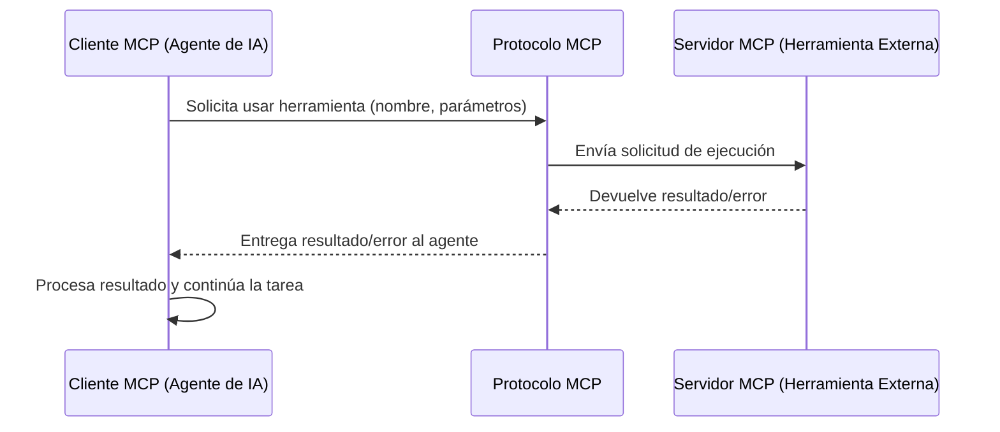

# Servidor MCP

Este documento describe el rol y las características de un Servidor MCP (Model Context Protocol) en el sistema de agentes.

## Definición

Un **Servidor MCP** es un componente que expone una o más [[Capacidad|capacidades]] (herramientas, recursos, prompts) a los [[Cliente MCP|Clientes MCP]] (agentes de IA o LLMs) a través del [[Modelo de Contexto (MCP)|Protocolo MCP]]. Actúa como un intermediario que traduce las solicitudes estandarizadas del cliente en acciones ejecutables en el sistema subyacente o en servicios externos.

## Funcionalidades del Servidor MCP

-   **Exposición de Capacidades**: Anuncia qué herramientas y recursos están disponibles para los clientes.
-   **Ejecución de Herramientas**: Recibe solicitudes de ejecución de herramientas del cliente y las lleva a cabo.
-   **Gestión de Recursos**: Proporciona acceso controlado a recursos de datos (archivos, bases de datos).
-   **Manejo de Respuestas**: Formatea los resultados de la ejecución de herramientas o el acceso a recursos en un formato compatible con MCP y los devuelve al cliente.
-   **Seguridad y Aislamiento**: Puede implementar sandboxing y mecanismos de autorización para proteger el sistema subyacente.
-   **Logging**: Registra las interacciones y la ejecución de herramientas para auditoría y depuración.

## Flujo de Interacción

## Importancia en el Proyecto

En nuestro sistema, varios servicios actúan como Servidores MCP, permitiendo a los agentes de [[OpenCode]] interactuar con:

-   **Playwright**: Para automatización de navegadores.
-   **Chrome DevTools**: Para control directo del navegador.
-   **Context7**: Para consultar documentación de librerías.
-   **Storybook**: Para interactuar con componentes de UI.
-   **Stitch**: Para diseño de UI asistido por IA.

Estos servidores son configurados en el archivo `opencode.json` bajo la sección `mcp`.

## Relación con Otros Conceptos

- [[Modelo de Contexto (MCP)]]
- [[Cliente MCP]]
- [[Capacidad]]
- [[Herramientas del Sistema]]
- [[OpenCode]]

> [!note] Documento creado como placeholder.
> *Última actualización: 2026-04-27*