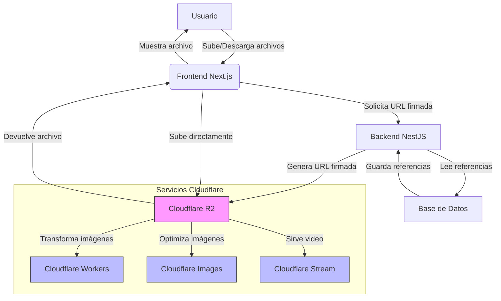

> [!info] Resumen
> Cloudflare R2 es un servicio de almacenamiento de objetos compatible con S3 que permite almacenar y recuperar grandes cantidades de datos sin cargos por salida de datos (egress fees). Este documento detalla su implementación en nuestro sistema de ticketera, beneficios específicos, casos de uso y mejores prácticas.

## Tabla de Contenidos

[[#Definición]] | [[#Casos-de-Uso-en-el-Sistema-de-Ticketera]] | [[#Beneficios-Específicos-para-Nuestro-Proyecto]] | [[#Integración-con-el-Tech-Stack-Actual]] | [[#Consideraciones-de-Seguridad]] | [[#Integración-con-Otros-Servicios-de-Cloudflare]] | [[#Mejores-Prácticas-de-Implementación]] | [[#Comparación-con-Alternativas]] | [[#Relación-con-Otros-Conceptos-del-Sistema]] | [[#Glosario-de-Términos]] | [[#Diagrama-de-Arquitectura]]

---

## Definición

**Cloudflare R2** es un servicio de almacenamiento de objetos compatible con S3 que permite almacenar y recuperar grandes cantidades de datos sin cargos por salida de datos (egress fees). Forma parte del ecosistema de Cloudflare y está diseñado para ser una alternativa económica y de alto rendimiento a servicios como Amazon S3.

> [!info] Características principales
> - **Compatible con API S3**: Puede usar las mismas bibliotecas y herramientas que con AWS S3
> - **Sin cargos por salida**: Ahorro significativo en costos de transferencia de datos
> - **Baja latencia**: Aprovecha la red global de Cloudflare para acceso rápido
> - **Integración nativa**: Funciona bien con otros servicios de Cloudflare (Workers, CDN, etc.)
> - **Escalabilidad automática**: Maneja desde pocos GB hasta petabytes sin intervención manual
> - **Seguridad de nivel empresarial**: Encriptación en reposo y en tránsito, control de acceso granular

## Casos de Uso en el Sistema de Ticketera

En el contexto de nuestro sistema de gestión de tickets, [[cloudflare-r2]] podría utilizarse para:

### 1. Almacenamiento de Activos de Eventos
- Imágenes de eventos (carteles, banners, fotos de artistas)
- Logos de organizadores y venues
- Material promocional
- Videos de previa o teasers

### 2. Generación y Almacenamiento de Tickets
- Códigos QR de tickets (como imágenes)
- Plantillas de tickets personalizadas
- Versiones de alta resolución para impresión
- Versiones optimizadas para móvil

### 3. Contenido Generado por Usuarios
- Fotos de perfil de usuarios
- Documentos de identificación subidos para verificación
- Comentarios y reseñas con adjuntos
- Material para reembolsos o disputas

### 4. Reportes y Analítica
- Exportaciones de reportes en PDF/Excel
- Grabaciones de eventos en vivo (archivado)
- Logs de auditoría a largo plazo
- Backups de bases de datos

### 5. Contenido Estático del Frontend
- Builds de la aplicación [[nextjs]] (si se opta por servir estáticos desde R2)
- Bibliotecas de componentes compartidos
- Fuentes tipográficas personalizadas
- Iconos y assets de UI

## Beneficios Específicos para Nuestro Proyecto

> [!success] Reducción de Costos
> - **Sin cargos por egress**: Cada descarga de ticket, imagen de evento o reporte no genera costos adicionales
> - **Precios competitivos**: Almacenamiento a tarifas inferiores a muchos proveedores tradicionales
> - **Predecibilidad**: Modelo de precios sencillo basado en almacenamiento y operaciones

> [!success] Rendimiento Mejorado
> - **Entrega global**: Los activos se sirven desde la ubicación más cercana al usuario mediante la red de Cloudflare
> - **Integración con Cloudflare CDN**: Posibilidad de usar R2 como origen para el CDN de Cloudflare
> - **Latencia baja**: Especialmente beneficioso para usuarios en América Latina donde Cloudflare tiene buena presencia

> [!success] Simplicidad Operativa
> - **API familiar**: Los desarrolladores ya conocen la API S3 desde experiencia con AWS u otros servicios
> - **Menos servicios que gestionar**: Un único proveedor para almacenamiento, CDN y seguridad básica
> - **Herramientas compatibles**: Funciona con herramientas existentes como aws-cli, s3fs, y bibliotecas SDK

## Integración con el Tech Stack Actual

### Backend ([[nestjs]])

> [!tip] Despliegue en Railway
> Cuando se despliegue el backend [[nestjs]] en [[railway]], las credenciales de R2 se pueden configurar como [[variables-de-entorno]] en el panel de Railway, asegurando un despliegue seguro y reproducible. Además, Railway proporciona logs y métricas básicas que complementan el monitoreo más detallado de [[sentry]].

#### Configuración del Cliente S3
```typescript
// src/common/providers/r2-storage.provider.ts
import { Injectable } from '@nestjs/common';
import { S3Client, PutObjectCommand, GetObjectCommand, DeleteObjectCommand } from '@aws-sdk/client-s3';

@Injectable()
export class R2StorageService {
  private s3Client: S3Client;
  private bucketName: string;

  constructor() {
    this.s3Client = new S3Client({
      endpoint: process.env.CLOUDFLARE_R2_ENDPOINT,
      region: 'auto', // R2 usa 'auto' como región
      credentials: {
        accessKeyId: process.env.CLOUDFLARE_R2_ACCESS_KEY_ID,
        secretAccessKey: process.env.CLOUDFLARE_R2_SECRET_ACCESS_KEY,
      },
    });
    this.bucketName = process.env.CLOUDFLARE_R2_BUCKET;
  }

  async uploadFile(key: string, file: Buffer, mimeType: string): Promise<string> {
    await this.s3Client.send(
      new PutObjectCommand({
        Bucket: this.bucketName,
        Key: key,
        Body: file,
        ContentType: mimeType,
      })
    );
    return key;
  }

  async getFile(key: string): Promise<Buffer> {
    const response = await this.s3Client.send(
      new GetObjectCommand({
        Bucket: this.bucketName,
        Key: key,
      })
    );
    return Buffer.from(await response.Body.transformToByteArray());
  }

  async deleteFile(key: string): Promise<void> {
    await this.s3Client.send(
      new DeleteObjectCommand({
        Bucket: this.bucketName,
        Key: key,
      })
    );
  }

  // Método para generar URLs firmadas (si se necesita acceso temporal)
  getSignedUrl(key: string, expiresIn: number = 3600): string {
    // Implementación usando @aws-sdk/s3-request-presigner
    // O alternativamente, construir URL directa si el bucket es público
    return `${process.env.CLOUDFLARE_R2_PUBLIC_URL}/${key}`;
  }
}
```

#### Uso en Servicios de Negocio
```typescript
// src/events/services/event-image.service.ts
@Injectable()
export class EventImageService {
  constructor(
    private r2Storage: R2StorageService,
    private eventsRepository: EventsRepository
  ) {}

  async uploadEventImage(eventId: string, imageBuffer: Buffer, mimeType: string): Promise<string> {
    const key = `events/${eventId}/images/${Date.now()}-${Math.random()
      .toString(36)
      .substring(2)}`;
    
    await this.r2Storage.uploadFile(key, imageBuffer, mimeType);
    
    // Actualizar referencia en la base de datos
    await this.eventsRepository.updateImageUrl(eventId, this.r2Storage.getSignedUrl(key));
    
    return this.r2Storage.getSignedUrl(key);
  }
}
```

### Frontend ([[nextjs]])

#### Subida Directa desde el Cliente (con firma de backend)
```typescript
// components/UploadForm.tsx
import { useState } from 'react';

interface UploadFormProps {
  onUploadComplete: (url: string) => void;
}

export function UploadForm({ onUploadComplete }: UploadFormProps) {
  const [file, setFile] = useState<File | null>(null);
  const [uploading, setUploading] = useState(false);
  const [error, setError] = useState<string | null>(null);
  const handleSubmit = async (e: React.FormEvent) => {
    e.preventDefault();
    if (!file) return;

    setUploading(true);
    setError(null);

    try {
      // 1. Obtener URL firmada y campos del backend
      const { data: uploadData } = await fetch(`/api/r2-upload-sign`, {
        method: 'POST',
        body: JSON.stringify({
          fileName: file.name,
          fileType: file.type,
          folder: 'event-images' // o cualquier carpeta específica
        })
      }).then(res => res.json());

      // 2. Subir directamente a R2 usando las credenciales temporales
      const formData = new FormData();
      Object.keys(uploadData.fields).forEach(key => {
        formData.append(key, uploadData.fields[key]);
      });
      formData.append('file', file);

      await fetch(uploadData.url, {
        method: 'POST',
        body: formData
      });

      // 3. Notificar éxito con la URL pública
      const publicUrl = `${process.env.NEXT_PUBLIC_CLOUDFLARE_R2_PUBLIC_URL}/${uploadData.key}`;
      onUploadComplete(publicUrl);
    } catch (err) {
      setError('Error al subir el archivo');
      console.error(err);
    } finally {
      setUploading(false);
    }
  };

  return (
    <form onSubmit={handleSubmit}>
      <input
        type="file"
        onChange={(e) => setFile(e.target.files?.[0] ?? null)}
        accept="image/*"
        disabled={uploading}
      />
      <button type="submit" disabled={uploading || !file}>
        {uploading ? 'Subiendo...' : 'Subir Imagen'}
      </button>
      {error && <p className="error">{error}</p>}
    </form>
  );
}
```

#### Ruta de API para Firmar Subidas (Next.js)
```typescript
// pages/api/r2-upload-sign.ts
import type { NextApiRequest, NextApiResponse } from 'next';
import { getSignedUrl } from '@aws-sdk/s3-request-presigner';
import { S3Client, PutObjectCommand } from '@aws-sdk/client-s3';

export default async function handler(
  req: NextApiRequest,
  res: NextApiResponse
) {
  if (req.method !== 'POST') {
    return res.status(405).json({ error: 'Method not allowed' });
  }

  const { fileName, fileType, folder } = req.body;
  
  if (!fileName || !fileType) {
    return res.status(400).json({ error: 'Missing required fields' });
  }

  const s3Client = new S3Client({
    endpoint: process.env.CLOUDFLARE_R2_ENDPOINT,
    region: 'auto',
    credentials: {
      accessKeyId: process.env.CLOUDFLARE_R2_ACCESS_KEY_ID,
      secretAccessKey: process.env.CLOUDFLARE_R2_SECRET_ACCESS_KEY,
    },
  });

  const key = `${folder}/${Date.now()}-${fileName.replace(/\s+/g, '-')}`;

  try {
    const url = await getSignedUrl(
      s3Client,
      new PutObjectCommand({
        Bucket: process.env.CLOUDFLARE_R2_BUCKET,
        Key: key,
        ContentType: fileType,
      }),
      { expiresIn: 300 } // 5 minutos para subir
    );

    res.status(200).json({
      url,
      fields: {
        key,
        // En un escenario real, podrías necesitar campos de política si usas POST policy
        // Pero con PutObjectCommand firmado, solo necesitas la URL
      },
      key: key, // Para que el frontend conozca la ubicación final
    });
  } catch (error) {
    console.error('Error generating signed URL:', error);
    res.status(500).json({ error: 'Failed to generate upload URL' });
  }
}
```

## Consideraciones de Seguridad

> [!warning] Protección de Credenciales
> - **Nunca expongan credencias en el frontend**: Las claves de acceso deben permanecer únicamente en el backend o en variables de entorno seguras
> - **Use tokens de corta duración**: Para subidas directas desde el cliente, genere [[url-firmada|URLs firmadas]] con tiempo de expiración limitado (5-15 minutos)
> - **Implemente control de acceso basado en roles**: Diferentes niveles de permiso para subir, leer y eliminar archivos

> [!warning] Validación de Archivos
> - **Valide tipo MIME**: No confíe únicamente en la extensión del archivo
> - **Limite tamaño de archivo**: Defina límites razonables según el tipo de contenido (ej: 5MB para imágenes de eventos, 50MB para videos)
> - **Escaneo de malware**: Considere integrar escaneo de virus para archivos subidos por usuarios (especialmente importante para documentos de identificación)

> [!warning] Configuración de Buckets
> - **Privacidad por defecto**: Mantenga los [[bucket|buckets]] privados y use [[url-firmada|URLs firmadas]] o intermediarios para acceder al contenido
> - **Reglas de CORS**: Configure apropiadamente si planea hacer solicitudes directas desde el navegador
> - **Registro de acceso**: Active logs para monitoreo y auditoría de acceso a archivos sensibles

## Integración con Otros Servicios de Cloudflare

> [!tip] Cloudflare Workers para Transformaciones
> Use Workers para:
> - Redimensionar imágenes al vuelo (ej: generar thumbnails de imágenes de eventos)
> - Aplicar marcas de agua a tickets o imágenes promocionales
> - Convertir formatos de archivo (ej: WebP para imágenes)
> - Implementar lógica de autorización personalizada

> [!tip] Cloudflare Stream para Video
> Para contenido de video (entrevistas, previas de eventos):
> - Use Cloudflare Stream para almacenamiento y transmisión de video
> - Combine con R2 para thumbnails y metadatos
> - Aproveche el encoding adaptativo y la protección de contenido

> [!tip] Cloudflare Images
> Para optimización automática de imágenes:
> - Considere usar Cloudflare Images para transformación y entrega optimizada
> - Puede usar R2 como origen y Images como capa de optimización
> - Ideal para imágenes de eventos que necesitan múltiples tamaños y formatos

## Mejores Prácticas de Implementación

> [!tip] Organización de Buckets
> Considere usar [[prefix|prefixes]] (carpetas lógicas) en lugar de múltiples [[bucket|buckets]]:
> ```
> ├── event-images/{eventId}/
> ├── event-videos/{eventId}/
> ├── user-uploads/{userId}/
> ├── ticket-templates/
> ├── report-exports/
> └── logos/
> ```

> [!tip] Estrategia de Nomenclatura
> Use un sistema de nombres que evite colisiones y facilite la organización:
> ```
> ├── {tipo}/{id}/{timestamp}-{random-string}.{ext}
> ├── {tipo}/{id}/{descripcion}-{version}.{ext}
> ```
> 
> Ejemplos:
> - `event-images/evt_123/20260427-abc123-poster.jpg`
> - `ticket-templates/vip-standard-template-v2.json`
> - `user-uploads/usr_456/id-front-20260427-def456.pdf`

> [!tip] Manejo de Versiones
> Para activos que cambian frecuentemente:
> - Incluya números de versión en el nombre del archivo
> - O use [[metadata|metadata]] de [[objeto|objetos]] para tracking de versiones
> - Considere [[politica-de-ciclo-de-vida|políticas de ciclo de vida]] para eliminar versiones antiguas

> [!tip] Monitoreo y Costos
> - Configure alertas para uso inusual de almacenamiento o operaciones
> - Revise periódicamente los costos (aunque R2 es económico, el uso descontrolado puede acumularse)
> - Implemente limpieza automática de archivos temporales o expirados
> - Integre con [[sentry]] para monitoreo de errores en operaciones de almacenamiento (subidas, descargas, eliminaciones fallidas)

## Comparación con Alternativas

| Característica | Cloudflare R2 | Amazon S3 | Google Cloud Storage | Azure Blob Storage |
|----------------|---------------|-----------|----------------------|-------------------|
| **Cargo por egress** | ❌ No | ✅ Sí | ✅ Sí | ✅ Sí |
| **Compatibilidad S3** | ✅ Total | ✅ Nativa | ✅ Interoperable | ✅ Interoperable |
| **Presencia en LatAm** | ✅ Bueno (CDN) | Varía por región | Limitado | Varía por región |
| **Integración con CDN** | ✅ Nativa (Cloudflare) | ⚠️ CloudFront (costo extra) | ⚠️ Cloud CDN | ⚠️ Azure CDN |
| **Precio almacenamiento** | 💰 Bajo | 💰 Medio-Alto | 💰 Medio | 💰 Medio |
| **Complejidad** | 😊 Baja | 😊 Baja | 😊 Baja | 😊 Medio |
| **Herramientas familiares** | ✅ Excelente | ✅ Excelente | ✅ Bueno | ✅ Bueno |

## Relación con Otros Conceptos del Sistema

Este servicio de almacenamiento se relaciona con varios aspectos de nuestra arquitectura:

- [[almacenamiento-de-archivos]] - Patrón general para manejo de archivos en el sistema
- [[integracion-con-backend]] - Cómo los servicios de backend utilizan almacenamiento externo
- [[optimizacion-de-imagenes]] - Estrategias para servir imágenes eficientemente
- [[manejo-de-activos-de-eventos]] - Gestión específica de multimedia relacionada con eventos
- [[seguridad-de-datos]] - Protección de información sensible almacenada
- [[costo-de-infraestructura]] - Análisis de gastos operativos del sistema
- [[arquitectura-de-nube]] - Decisiones generales sobre proveedores de servicios en la nube
- [[entradas-e-ticket]] - Almacenamiento de códigos QR y plantillas de tickets
- [[venue]] - Almacenamiento de imágenes y planos de venues
- [[cloudflare-workers]] - Ejecutar lógica personalizada cerca del usuario
- [[variables-de-entorno]] - Gestión segura de credenciales y configuración
- [[sdk-de-aws]] - Bibliotecas utilizadas para interactuar con R2
- [[politica-de-cors]] - Configuración para permitir acceso desde dominios específicos
- [[gestion-de-credenciales]] - Prácticas seguras para manejar claves de acceso
- [[railway]] - Plataforma donde desplegamos nuestro backend NestJS que interactúa con R2 para el almacenamiento de activos
- [[sentry]] - Sistema que utilizamos para monitoreo de errores y rendimiento en las operaciones de R2 (subidas, descargas, eliminaciones) de nuestro sistema de ticketera

## Glosario de Términos

- **[[egress]]**: Transferencia de datos fuera de la red del proveedor de almacenamiento (lo que R2 no cobra)
- **[[url-firmada]]**: URL temporal que otorga permiso limitado para acceder a un objeto específico
- **[[prefix]]**: Organización lógica de objetos dentro de un bucket usando barras diagonales en las claves (similar a carpetas)
- **[[metadata]]**: Información adicional asociada a un objeto (como autor, fecha de creación, etc.)
- **[[politica-de-ciclo-de-vida]]**: Reglas automáticas para transicionar o eliminar objetos basado en edad u otros criterios
- **[[multipart-upload]]**: Método para subir archivos grandes en partes simultáneas o secuenciales
- **[[etag]]**: Identificador único para una versión específica de un objeto (útil para detección de cambios)
- **[[versioning]]**: Capacidad de mantener múltiples versiones de un objeto cuando se sobrescribe
- **[[cors]]**: Mecanismo que permite o restringe solicitudes web desde diferentes orígenes
- **[[bucket]]**: Contenedor de almacenamiento en R2 donde se guardan los objetos
- **[[objeto]]**: Unidad individual de almacenamiento en R2 (un archivo con su metadata)
- **[[clave-key]]**: Identificador único de un objeto dentro de un bucket
- **[[region]]**: En R2 siempre se usa 'auto' ya que es global por diseño
- **[[endpoint]]**: URL del servicio R2 a la que se conectan las aplicaciones
- **[[access-key-id]]**: Parte de las credenciales para autenticación con R2
- **[[secret-access-key]]**: Parte secreta de las credenciales para autenticación con R2

## Diagrama de Arquitectura



> [!note] Documento mejorado siguiendo las mejores prácticas de Obsidian Flavored Markdown
> *Última actualización: 2026-04-27*