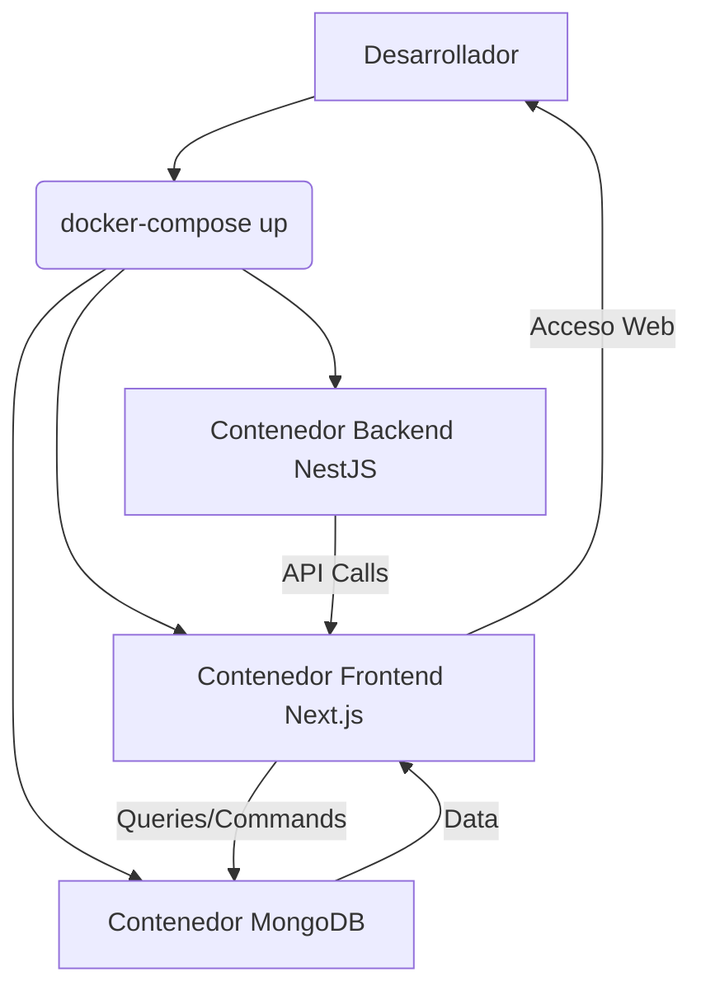

# Docker

## Definición

**Docker** es una plataforma de código abierto que permite a los desarrolladores empaquetar aplicaciones y sus dependencias en unidades estandarizadas llamadas **contenedores**. Estos contenedores son ligeros, portátiles y auto-suficientes, lo que garantiza que una aplicación se ejecute de manera consistente en cualquier entorno, desde el desarrollo local hasta la producción en la nube.

> [!info] Conceptos Clave
> -   **Contenedor**: Una unidad ejecutable de software que empaqueta código, sus dependencias y configuraciones. Es una instancia de una imagen.
> -   **Imagen**: Una plantilla de solo lectura que contiene las instrucciones para crear un contenedor Docker. Las imágenes se construyen a partir de un `Dockerfile`.
> -   **Dockerfile**: Un archivo de texto que contiene una serie de instrucciones para construir una imagen Docker.
> -   **Docker Engine**: El software cliente-servidor que construye, ejecuta y gestiona los contenedores.
> -   **Docker Hub / Registros**: Repositorios para almacenar y compartir imágenes Docker.
> -   **Docker Compose**: Una herramienta para definir y ejecutar aplicaciones Docker multi-contenedor.

## Uso en el Sistema de Ticketera

En nuestro proyecto, Docker es fundamental para garantizar un entorno de desarrollo consistente, facilitar el despliegue y la escalabilidad de nuestros servicios de backend y frontend.

### 1. Entorno de Desarrollo Local

Utilizamos `docker-compose.yml` para orquestar nuestros servicios de desarrollo local:

-   **Backend (NestJS)**: Contenedor para la aplicación NestJS.
-   **Frontend (Next.js)**: Contenedor para la aplicación Next.js.
-   **Base de Datos (MongoDB)**: Contenedor para la instancia de MongoDB.

Esto asegura que todos los desarrolladores trabajen con las mismas versiones de Node.js, MongoDB y otras dependencias, eliminando problemas de "funciona en mi máquina".

### 2. Despliegue en Producción y Staging

Aunque plataformas como [[Railway]] y [[Seenode]] pueden usar buildpacks para desplegar aplicaciones sin Dockerfiles explícitos, el uso de Dockerfiles nos da un control más granular sobre el entorno de ejecución.

-   **Backend (NestJS)**: Se construye una imagen Docker a partir de un `Dockerfile` en el directorio `desarrollo/venta-entradas-v2-backend`.
-   **Frontend (Next.js)**: Se construye una imagen Docker a partir de un `Dockerfile` en el directorio `desarrollo/venta-entradas-v2-frontend`.

Estas imágenes se despliegan en nuestros entornos de staging y producción, garantizando la consistencia entre el desarrollo y la producción.

### Arquitectura de Contenedores (Desarrollo Local)

## Beneficios para el Proyecto

### [!success] Consistencia del Entorno
-   **"Funciona en mi máquina" resuelto**: Las aplicaciones se ejecutan de la misma manera en desarrollo, staging y producción.
-   **Aislamiento**: Los servicios están aislados entre sí, evitando conflictos de dependencias.

### [!success] Portabilidad
-   **Despliegue Flexible**: Las imágenes Docker pueden ejecutarse en cualquier sistema que tenga Docker Engine, desde laptops hasta servidores en la nube.
-   **Migración Sencilla**: Facilita la migración entre diferentes proveedores de infraestructura.

### [!success] Eficiencia en el Desarrollo
-   **Onboarding Rápido**: Nuevos desarrolladores pueden configurar su entorno de trabajo en minutos.
-   **Desarrollo Aislado**: Permite a los desarrolladores trabajar en diferentes características sin afectar a otros servicios.

### [!success] Escalabilidad y Gestión
-   **Escalado Sencillo**: Fácil de escalar servicios individualmente añadiendo más instancias de contenedores.
-   **Gestión de Dependencias**: Todas las dependencias de la aplicación están empaquetadas en el contenedor.

## Integración con Otros Servicios

-   **[[Railway]] / [[Seenode]]**: Plataformas de despliegue que soportan imágenes Docker o buildpacks que internamente usan contenedores.
-   **[[NestJS]] / [[Next.js]]**: Nuestras aplicaciones backend y frontend se empaquetan en contenedores Docker.
-   **MongoDB**: La base de datos se ejecuta en un contenedor Docker en desarrollo local.
-   **[[CI-CD]]**: Los pipelines de integración y despliegue continuo construyen y publican imágenes Docker.
-   **[[Cloudflare R2]]**: Aunque no directamente relacionado con Docker, las aplicaciones en contenedores interactúan con R2 para almacenamiento de objetos.

## Mejores Prácticas de Implementación

### [!tip] Dockerfiles Optimizados
-   **Imágenes Base Ligeras**: Usar imágenes base pequeñas (ej. `node:alpine`) para reducir el tamaño de la imagen final.
-   **Multi-stage Builds**: Utilizar builds de múltiples etapas para separar el entorno de construcción del entorno de ejecución, reduciendo el tamaño de la imagen.
-   **Capa de Caché**: Organizar las instrucciones del Dockerfile para aprovechar el caché de capas de Docker (ej. instalar dependencias antes de copiar el código de la aplicación).
-   **Variables de Entorno**: No incluir secretos directamente en el Dockerfile; usar variables de entorno.

### [!tip] Docker Compose
-   **Servicios Claros**: Definir cada servicio con un nombre descriptivo.
-   **Volúmenes**: Usar volúmenes para persistir datos de la base de datos y para hot-reloading en desarrollo.
-   **Redes**: Definir redes personalizadas para la comunicación entre servicios.

### [!tip] Seguridad
-   **Menos Privilegios**: Ejecutar contenedores con el menor número de privilegios posible.
-   **Escaneo de Vulnerabilidades**: Escanear imágenes Docker en busca de vulnerabilidades conocidas.
-   **Actualización de Imágenes Base**: Mantener las imágenes base actualizadas para parchear vulnerabilidades.

## Solución de Problemas Comunes

### [!warning] Problemas de Permisos
-   **Síntoma**: Errores de acceso a archivos dentro del contenedor.
-   **Solución**: Asegurarse de que el usuario que ejecuta la aplicación dentro del contenedor tenga los permisos adecuados sobre los archivos y directorios.

### [!warning] Tamaño Excesivo de Imágenes
-   **Síntoma**: Las imágenes Docker son muy grandes, lo que ralentiza los builds y despliegues.
-   **Solución**: Implementar multi-stage builds, usar imágenes base `alpine`, limpiar cachés y dependencias innecesarias.

### [!warning] Problemas de Red en Docker Compose
-   **Síntoma**: Los servicios no pueden comunicarse entre sí.
-   **Solución**: Verificar los nombres de los servicios en `docker-compose.yml` y asegurarse de que estén en la misma red.

## Glosario de Términos

-   **Contenedor**: Instancia ejecutable de una imagen Docker.
-   **Imagen Docker**: Plantilla de solo lectura para crear contenedores.
-   **Dockerfile**: Archivo de instrucciones para construir una imagen.
-   **Docker Compose**: Herramienta para definir y ejecutar aplicaciones multi-contenedor.
-   **Volumen**: Mecanismo para persistir datos generados por y usados por contenedores Docker.
-   **Red Docker**: Permite la comunicación entre contenedores.
-   **Buildpack**: Herramienta que detecta el lenguaje de la aplicación y construye una imagen Docker sin un Dockerfile explícito.

## Relación con Otros Conceptos del Sistema

- [[Railway]] - Plataforma de despliegue que utiliza contenedores.
- [[Seenode]] - Plataforma de despliegue que utiliza contenedores.
- [[NestJS]] - Nuestro backend se ejecuta en contenedores Docker.
- [[Next.js]] - Nuestro frontend se ejecuta en contenedores Docker.
- [[CI-CD]] - Los pipelines de CI/CD construyen y despliegan imágenes Docker.
- [[MongoDB]] - Se ejecuta en un contenedor Docker en desarrollo.
- [[Arquitectura-de-nube]] - Docker es un pilar de nuestra estrategia de nube.

> [!note] Documento creado siguiendo las mejores prácticas de Obsidian Flavored Markdown
> *Última actualización: 2026-04-27*