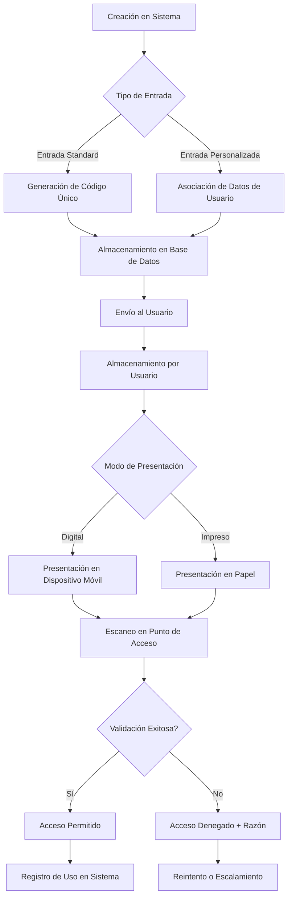

# Entradas y E-Tickets

> [!info] Resumen
> Este documento describe el concepto, características, flujo de vida y aspectos técnicos de los e-tickets (entradas electrónicas) en el sistema de venta de entradas.

## Definición

Un **e-ticket** (entrada electrónica) es una versión digital de una entrada tradicional que permite el acceso a eventos mediante códigos únicos, generalmente en formato QR o código de barras, almacenados en dispositivos móviles o impresos.

## Características Principales

> [!tip] Características Destacadas
> Los e-tickets ofrecen ventajas significativas sobre las entradas tradicionales en términos de seguridad, comodidad y eficiencia operativa.

- **Formato Digital**: Almacenado electrónicamente (no requiere papel físico)
- **Identificación Única**: Cada e-ticket tiene un código identificador único
- **Verificación en Tiempo Real**: Puede validarse instantáneamente en puntos de acceso
- **Portabilidad**: Accesible desde smartphones, tablets o impresiones
- **Seguridad**: Incorpora medidas anti-fraude y duplicación

## Tipos de E-Tickets en el Sistema

### Por Formato de Entrega

- **Mobile Ticket**: Envío directo a aplicación móvil o wallet ([[Apple-Google-Pay|Apple/Google Pay]])
- **Email Ticket**: Envío vía correo electrónico con archivo adjunto o link
- **SMS Ticket**: Envío mediante mensaje de texto con código alfanumérico
- **Impreso en Casa**: PDF descargable para auto-impresión

### Por Tipo de Evento

- **Entrada General**: Acceso estándar al evento
- **Entrada VIP**: Beneficios adicionales (mejor ubicación, acceso exclusivo)
- **Entrada con Consumo**: Incluye consumiciones (bebidas, comida)
- **Entrada Fecha/Hora Específica**: Para entradas con horario determinado
- **Entrada Transferible**: Permite cambio de titularidad
- **Entrada No Transferible**: Vinculada a identidad específica

### Por Estado

- **Activa**: Válida para uso
- **Usada**: Ya fue validada en acceso
- **Cancelada**: Anulada por organizador o usuario
- **Expirada**: Fuera del período de validez
- **En Disputa**: Sujeto a reclamo o reembolso

## Flujo de Vida del E-Ticket



## Componentes Técnicos

### Estructura de Datos del E-Ticket

```json
{
  "ticketId": "uuid_v4",
  "eventId": "referencia_al_evento",
  "userId": "comprador_asociado",
  "ticketType": "general|vip|consumo|etc",
  "seatInfo": {
    "section": "string",
    "row": "number",
    "seat": "number"
  },
  "price": {
    "base": "number",
    "taxes": "number",
    "total": "number"
  },
  "qrCode": "string_base64_or_path",
  "barcode": "string_alphanumeric",
  "issueDate": "timestamp",
  "validFrom": "timestamp",
  "validUntil": "timestamp",
  "status": "active|used|cancelled|expired",
  "validationCount": "number",
  "lastValidation": "timestamp",
  "validationLocation": "string",
  "transferable": "boolean",
  "transferHistory": [
    {
      "fromUserId": "string",
      "toUserId": "string",
      "timestamp": "timestamp",
      "approvedBy": "string"
    }
  ],
  "metadata": {
    "promoCode": "string",
    "channel": "web|mobile|box_office",
    "deviceInfo": "object"
  }
}
```

### Procesos de Validación

> [!warning] Importante
> El proceso de validación debe seguir estrictamente estos pasos para garantizar la seguridad del sistema.

1. **Escaneo**: Lectura del código QR/barras mediante dispositivo móvil o scanner dedicado
2. **Verificación de Formato**: Validación de estructura del código
3. **Consulta BD**: Búsqueda del ticketId en base de datos
4. **Chequeo de Estado**: Verificación de que esté activo y no usado
5. **Validación Temporal**: Confirmación de que esté dentro del período válido
6. **Prevención de Duplicados**: Check de que no haya sido usado previamente
7. **Registro**: Actualización de estado a "usado" con timestamp y ubicación
8. **Respuesta**: Confirmación visual/sonora al validador

## Beneficios del Sistema de E-Tickets

### Para Organizadores

> [!success] Ventajas Clave
> Estos beneficios impactan directamente en la rentabilidad y eficiencia de la organización de eventos.

- **Reducción de Costos**: Eliminación de impresión, distribución y manejo físico
- **Control en Tiempo Real**: Monitoreo instantáneo de ventas y accesos
- **Reducción de Fraude**: Difícil de falsificar con códigos únicos y validación centralizada
- **Mejor Experiencia**: Menor tiempo de espera en accesos
- **Datos Valiosos**: Información detallada sobre asistentes y comportamientos
- **Flexibilidad**: Capacidad para hacer cambios de último minuto (horarios, ubicación)

### Para Asistentes

- **Comodidad**: No riesgo de pérdida, robo o daño físico
- **Acceso Inmediato**: Disponible desde momento de compra
- **Transferibilidad Fácil**: Posibilidad de regalar o revender (según políticas)
- **Amigable con Medio Ambiente**: Reducción de uso de papel
- **Integración**: Compatibilidad con wallets móviles y apps de eventos
- **Recuperación**: Posibilidad de reenvío si se pierde el acceso

### Para el Sistema

- **Escalabilidad**: Manejo eficiente de grandes volúmenes
- **Integrabilidad**: Fácil conexión con sistemas de pago, CRM y control de acceso
- **Auditoría Completa**: Trazabilidad total de cada ticket
- **Personalización**: Capacidad para crear diferentes tipos de tickets
- **Analytics**: Generación de reportes detallados para mejora continua

## Consideraciones de Seguridad

### Medidas Anti-Fraude

> [!danger] Crítico
> Implementar todas estas medidas es esencial para prevenir fraudes y mantener la integridad del sistema.

- **Criptografía**: Códigos generados con algoritmos seguros
- **Unicidad Garantizada**: Sistema de generación que evita colisiones
- **Validación Centralizada**: Todos los escaneos verificados contra BD maestra
- **Límites de Intento**: Bloqueo tras múltiples intentos fallidos
- **Geolocalización**: Registro de ubicación de validación (opcional)
- **Dispositivo de Confianza**: Opcional vinculación a dispositivo específico
- **Time-limited Codes**: Códigos que expiran tras cierto tiempo de visualización

### Protección de Datos

- **Cifrado en Reposo**: Información sensible en BD cifrada
- **Transmisión Segura**: Uso de HTTPS/TLS para todas las comunicaciones
- **Minimización de Datos**: Solo almacenar información necesaria
- **Cumplimiento GDPR**: Derecho al olvido y portabilidad de datos
- **Tokenización**: Sustitución de datos sensibles por tokens cuando es posible

## Integración con Otros Sistemas

### Sistemas de Pago

> [!note] Proceso Automático
> La generación de tickets se dispara automáticamente tras la confirmación de pago.

- Generación automática de ticket tras confirmación de pago
- Manejo de reembolsos y anulaciones sincronizados
- Conciliación financiera entre ventas y tickets generados

### Sistemas de Control de Acceso

- Comunicación en tiempo real con hardware de escaneo
- Formatos de salida compatibles con diversos scanners
- Modo offline para áreas con mala conectividad
- Sincronización posterior cuando se recupera conexión

### Sistemas de CRM y Marketing

- Enriquecimiento de perfiles de usuario con historial de eventos
- Segmentación basada en tipo y frecuencia de asistencia
- Triggers para comunicaciones post-evento (encuestas, ofertas)
- Integración con programas de lealtad

### Sistemas de Reportes y BI

- Exportación de datos para análisis de tendencias
- Métricas en tiempo real de ventas y accesos
- Dashboards operativos para staff del evento
- Reportes de cumplimiento para autoridades

## Mejores Prácticas de Implementación

### Diseño de la Experiencia de Usuario

> [!tip] UX Recomendado
> Seguir estas prácticas mejora significativamente la adopción y satisfacción del usuario final.

- **Claridad en Comunicación**: Instrucciones explícitas sobre cómo acceder y usar el e-ticket
- **Diseño Responsivo**: Visualización óptima en todos los dispositivos
- **Accesibilidad**: Cumplimiento con WCAG para usuarios con discapacidades
- **Multiidioma**: Soporte para idiomas según audiencia del evento
- **Branding Consciente**: Integración sutil de marca del evento y organizador

### Arquitectura Técnica

- **Escalabilidad Horizontal**: Diseño para manejar picos de venta y acceso
- **Cache Estratégico**: Almacenamiento temporal de tickets frecuentemente validados
- **Colas de Procesamiento**: Para generación masiva de tickets
- **Monitoreo y Alertas**: Detección temprana de anomalías en validación
- **Backup y Recuperación**: Planes de contingencia para pérdida de servicio
- **Pruebas de Carga**: Simulación de escenarios de alta demanda

### Operaciones y Soporte

- **Capacitación del Staff**: Entrenamiento en procedimientos de validación y solución de problemas
- **Protocolos de Contingencia**: Planes para fallos de conectividad o hardware
- **Soporte en Tiempo Real**: Equipo disponible durante eventos para incidencias
- **Post-Evento Analysis**: Revisión de métricas y lecciones aprendidas
- **Mejora Continua**: Incorporación de feedback en versiones futuras

## Tendencias Futuras

### Tecnologías Emergentes

- **Blockchain para Tickets**: Tickets como NFTs con propiedades de colección y reventa segura
- **Reconocimiento Facial**: Validación biométrica como alternativa o complemento al escaneo
- **Geofencing**: Activación automática de ticket al acercarse al venue
- **Realidad Aumentada**: Experiencias mejoradas al mostrar el ticket mediante AR
- **Internet of Things (IoT)**: Integración con wearables y dispositivos inteligentes del venue

### Evolución del Modelo de Negocio

- **Tickets Dinámicos**: Precio que varía según demanda en tiempo real
- **Microtransacciones**: Upgrades y add-ons comprables directamente desde el ticket
- **Secondary Market Oficial**: Plataforma autorizada para reventa con control de organizador
- **Suscripciones de Eventos**: Acceso a múltiples eventos mediante modelo de suscripción
- **Data Monetization**: Uso ético y anonimizado de datos de asistencia para insights de mercado

## Glosario de Términos

- **QR Code**: Código de respuesta rápida, matriz de puntos que almacena información legible por cámara
- **Barcode**: Código de barras tradicional, secuencia de líneas y espacios que representa datos alfanuméricos
- **Wallet**: Aplicación móvil que almacena tickets, tarjetas de pago y otros pases digitales
- **Scan Validity**: Período durante el cual un ticket puede ser validado para acceso
- **Fraude de Duplicación**: Intento de usar una copia de un ticket válido múltiples veces
- **Transferencia de Titularidad**: Cambio de la persona asociada a un ticket
- **No-Show**: Titular de ticket que no asiste al evento pese a tener entrada válida
- **Walk-up**: Compra de ticket en el lugar del evento el mismo día
- **Will Call**: Servicio donde el ticket se retira en taquilla el día del evento con identificación
- **Dynamic Pricing**: Ajuste de precios en tiempo real basado en demanda y otros factores

> [!example] Enlaces Relacionados
> Consulte estos documentos para información complementaria:
> - [[Taxonomía-de-eventos]] - Para entender la clasificación de eventos
> - [[Procesos-de-validación]] - Detalles técnicos de los procesos de validación
> - [[Integración-de-sistemas-pago]] - Información sobre integración con pasarelas de pago
> - [[Medidas-de-seguridad]] - Especificaciones de seguridad aplicables