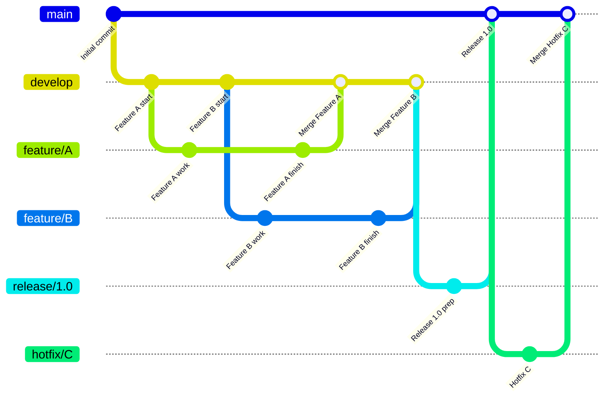

# Git

## Definición

**Git** es un sistema de control de versiones distribuido (DVCS) de código abierto, diseñado para gestionar proyectos de software de cualquier tamaño con velocidad y eficiencia. Permite a múltiples desarrolladores trabajar en el mismo proyecto simultáneamente, rastrear cambios, fusionar código y revertir a versiones anteriores si es necesario.

## Conceptos Clave

-   **Repositorio (Repository)**: El directorio de trabajo de un proyecto, que contiene todos los archivos del proyecto y el historial de revisiones de Git.
-   **Commit**: Una instantánea de los cambios realizados en el repositorio en un momento dado. Cada commit tiene un mensaje descriptivo y un ID único.
-   **Rama (Branch)**: Una línea independiente de desarrollo. Permite a los desarrolladores trabajar en nuevas funcionalidades o correcciones de errores sin afectar la línea principal de código.
-   **Merge**: El proceso de combinar los cambios de una rama en otra.
-   **Pull Request (PR)**: Un mecanismo para notificar a los miembros del equipo que los cambios en una rama están listos para ser revisados y fusionados en otra rama.
-   **Clonar (Clone)**: Crear una copia local de un repositorio remoto.
-   **Push**: Enviar los commits locales a un repositorio remoto.
-   **Pull**: Descargar los cambios de un repositorio remoto y fusionarlos en el repositorio local.

## Importancia en el Proyecto

Git es la herramienta fundamental para la colaboración y la gestión del código fuente en nuestro proyecto de sistema de ticketera.

-   **Colaboración**: Permite que el equipo de desarrollo trabaje de forma conjunta en el frontend [[nextjs]] y el backend [[nestjs]].
-   **Historial de Cambios**: Mantiene un registro completo de todos los cambios realizados en el código, quién los hizo y cuándo.
-   **Control de Versiones**: Facilita la gestión de diferentes versiones de la aplicación y la reversión a estados anteriores si es necesario.
-   **Integración Continua**: Es la base para nuestros pipelines de [[ci-cd|CI/CD]], que se activan con cada commit o pull request.

## Flujo de Trabajo Típico (Gitflow Simplificado)

## Mejores Prácticas

### [!tip] Commits Atómicos y Descriptivos
-   Cada commit debe representar un cambio lógico y coherente.
-   Los mensajes de commit deben ser claros y concisos, explicando el "por qué" del cambio.

### [!tip] Ramas Cortas y Específicas
-   Crear ramas para cada nueva funcionalidad o corrección de error (ej. `feature/nombre-funcionalidad`, `bugfix/id-bug`).
-   Mantener las ramas lo más cortas posible para facilitar las fusiones.

### [!tip] Pull Requests (PRs)
-   Utilizar PRs para la revisión de código y la discusión antes de fusionar los cambios.
-   Asegurarse de que los PRs pasen todas las pruebas automatizadas en el pipeline de [[ci-cd|CI/CD]].

### [!tip] Integración Frecuente
-   Realizar `git pull` frecuentemente para integrar los cambios de otros desarrolladores.
-   Integrar los propios cambios en la rama principal (ej. `develop`) tan a menudo como sea posible.

## Relación con Otros Conceptos

- [[ci-cd]] - Git es el disparador principal de los pipelines de CI/CD.
- [[github]] (I will create this file later if it doesn't exist) - Plataforma de alojamiento de repositorios Git.
- [[calidad-de-codigo]] - Las revisiones de código a través de PRs contribuyen a la calidad.
- [[flujos-de-trabajo]] - Gitflow o GitHub Flow definen flujos de trabajo de desarrollo.

> [!note] Documento creado como placeholder.
> *Última actualización: 2026-04-27*