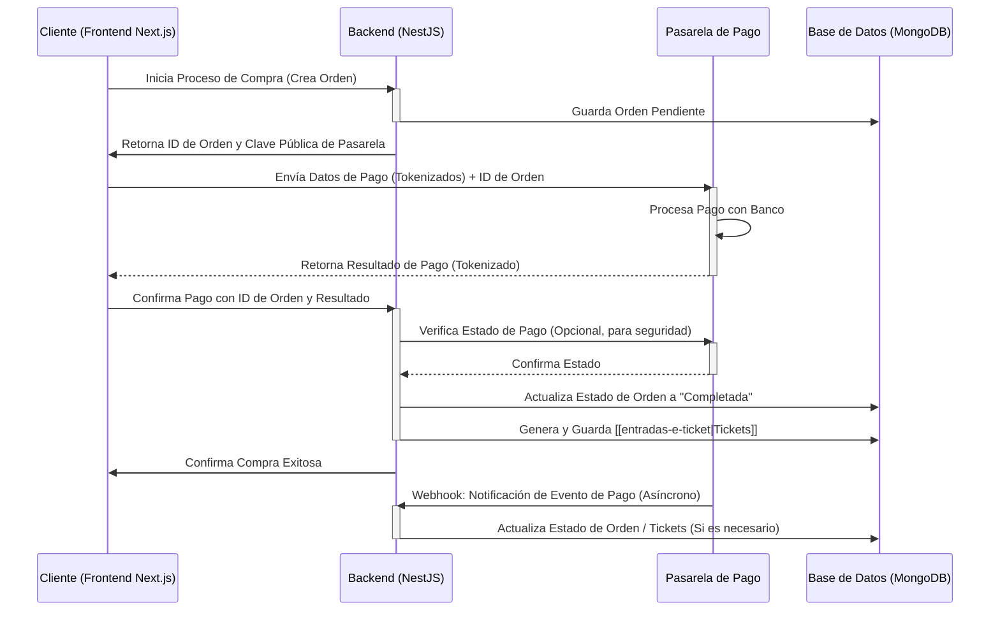

# Integración de Sistemas de Pago

## Definición

La **Integración de Sistemas de Pago** se refiere al proceso de conectar nuestra aplicación con una o varias pasarelas de pago externas para procesar transacciones financieras de forma segura. Esto permite a los usuarios comprar [[entradas-e-ticket|tickets]] y a los organizadores recibir los fondos.

## Importancia en el Sistema de Ticketera

La integración de un sistema de pago fiable y seguro es fundamental para el éxito de nuestra plataforma de venta de entradas:

-   **Procesamiento de Transacciones**: Permite a los usuarios realizar compras de forma eficiente.
-   **Seguridad**: Garantiza que la información financiera sensible de los usuarios esté protegida.
-   **Cumplimiento**: Ayuda a cumplir con las normativas de seguridad de datos de la industria de pagos (PCI DSS).
-   **Experiencia de Usuario**: Ofrece un proceso de pago fluido y sin fricciones.

## Componentes Clave de la Integración

1.  **Pasarela de Pago (Payment Gateway)**: Un servicio externo que autoriza pagos con tarjeta de crédito o débito, transferencias bancarias, etc. (ej. Stripe, PayPal, Webpay).
2.  **Procesador de Pagos (Payment Processor)**: La entidad que maneja la transacción real entre el banco del cliente y el banco del comerciante.
3.  **Tokenización**: El proceso de reemplazar datos sensibles (ej. número de tarjeta de crédito) con un token único que no tiene valor intrínseco.
4.  **Webhooks**: Mecanismos para que la pasarela de pago notifique a nuestro backend sobre el estado de una transacción (ej. pago exitoso, fallido, reembolso).

## Flujo de Pago Típico

## Consideraciones de Seguridad y Cumplimiento

-   **PCI DSS**: Cumplir con los estándares de seguridad de datos de la industria de tarjetas de pago. La tokenización y el uso de pasarelas de pago externas ayudan a reducir el alcance de este cumplimiento.
-   **HTTPS**: Todas las comunicaciones deben realizarse a través de HTTPS.
-   **Validación de Webhooks**: Verificar la autenticidad de los webhooks recibidos de la pasarela de pago.
-   **No Almacenar Datos Sensibles**: Nunca almacenar números de tarjeta de crédito o CVV en nuestra propia base de datos.

## Implementación Técnica

-   **Backend ([[nestjs]])**: Maneja la lógica de integración con la pasarela de pago, procesa [[webhooks]] y actualiza el estado de las órdenes y [[entradas-e-ticket|tickets]].
-   **Frontend ([[nextjs]])**: Recopila la información de pago del usuario y la envía a la pasarela de pago (a menudo a través de un SDK de la pasarela) o al backend.

## Relación con Otros Conceptos

- [[entradas-e-ticket]] - Los tickets se generan tras un pago exitoso.
- [[seguridad-de-datos]] - Fundamental para proteger la información financiera.
- [[nestjs]] - Backend que gestiona la integración de pagos.
- [[nextjs]] - Frontend que inicia el proceso de pago.
- [[base-de-datos-mongodb]] - Almacena el estado de las órdenes y tickets.
- [[webhooks]] - Mecanismo de comunicación asíncrona.

> [!note] Documento creado como placeholder.
> *Última actualización: 2026-04-27*