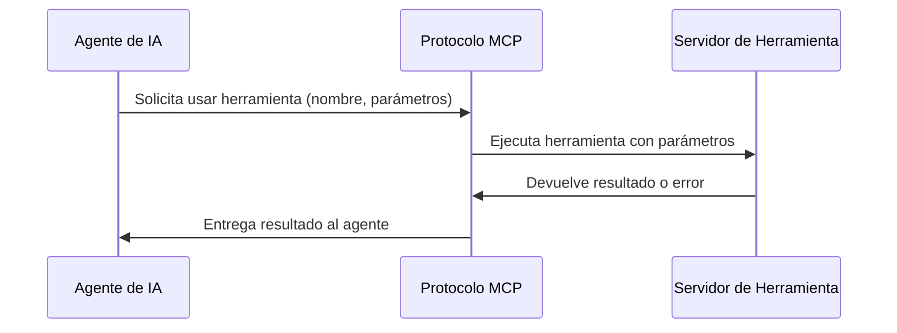

# Modelo de Contexto (MCP)

> [!tip] Tiempo estimado de lectura
> 12-15 minutos

## Definición

El **Modelo de Contexto (MCP, Model Context Protocol)** es un protocolo estándar que permite a los modelos de lenguaje grandes (LLMs) interactuar de manera segura y estructurada con herramientas externas, fuentes de datos y entornos de computación. MCP establece una forma consistente para que los modelos de IA accedan a capacidades más allá de su conocimiento interno, como ejecutar código, consultar bases de datos, leer archivos o interactuar con APIs.

> [!info] Características principales
> - **Estándar abierto**: Protocolo público para interacción entre LLMs y herramientas externas
> - **Seguridad**: Mecanismos de autorización y sandboxing para proteger el sistema
> - **Extensibilidad**: Fácil de agregar nuevas herramientas y capacidades
> - **Interoperabilidad**: Compatibilidad entre diferentes modelos de IA y proveedores
> - **Contexto estructurado**: Comunicación clara de capacidades, limitaciones y resultados

## Cómo Funciona MCP

MCP opera mediante un modelo cliente-servidor donde:

1. **Cliente MCP**: El modelo de IA o agente que solicita el uso de una herramienta
2. **Servidor MCP**: El proveedor de la herramienta o capacidad externa
3. **Mensajes estandarizados**: Formato definido para solicitudes, respuestas y notificaciones

### Flujo Básico

## Componentes de MCP

### 1. Capabilities (Capacidades)
Definen qué puede hacer una herramienta MCP:
- **Recursos**: Fuentes de datos que pueden leerse (archivos, bases de datos, APIs)
- **Herramientas**: Funciones ejecutables que realizan acciones
- **Prompts**: Plantillas predefinidas para interacciones comunes
- **Logging**: Capacidad para generar registros de actividad

### 2. Mensajes Estándar
- **Solicitud**: Cliente pide al servidor ejecutar una operación
- **Respuesta**: Servidor devuelve el resultado de la operación
- **Notificación**: Envío unidireccional de información (logs, progreso)
- **Error**: Comunicación de fallos en la ejecución

### 3. Transporte
MCP puede operar sobre diferentes mecanismos de transporte:
- **Stdio**: Entrada/salida estándar (para herramientas locales)
- **HTTP/SSE**: Para herramientas remotas o basadas en web
- **WebSocket**: Para comunicación bidireccional en tiempo real

## Uso en el Sistema de Agentes

En nuestro sistema de agentes especializados, MCP podría utilizarse para:

### 1. Extender Capacidades de los Agentes
Permitir que los agentes accedan a:
- Sistemas de archivos locales o remotos
- Bases de datos (MongoDB, PostgreSQL, etc.)
- APIs externas (servicios de pago, geolocalización, etc.)
- Herramientas de desarrollo (linters, compiladores, test runners)
- Servicios de IA adicionales (modelos especializados, APIs de visión, etc.)

### 2. Ejecución Segura de Código
- Ejecutar scripts de prueba en entornos aislados
- Realizar consultas de base de datos de forma controlada
- Ejecutar migraciones o scripts de administración
- Renderizar vistas o generar reportes

### 3. Integración con Herramientas Externas
- Conectar con servicios de CI/CD para despliegues
- Interactuar con plataformas de monitoreo y logging
- Acceder a sistemas de gestión de tickets o proyectos
- Utilizar servicios de almacenamiento de objetos (como [[cloudflare-r2]])

## Beneficios para el Proyecto

### [!success] Mayor Capacidad de los Agentes
- Los agentes pueden hacer más allá de su conocimiento interno
- Acceso a herramientas especializadas sin necesidad de integrarlas directamente
- Capacidad para realizar tareas complejas que requieren múltiples sistemas

### [!success] Seguridad Mejorada
- Ejecución en entornos aislados ([[sandboxing-mcp|sandboxing]])
- Control preciso sobre qué capacidades tiene cada agente
- Auditoría de todas las interacciones con herramientas externas
- Posibilidad de revocar o limitar acceso según sea necesario

### [!success] Flexibilidad y Extensibilidad
- Fácil agregar nuevas herramientas según surjan necesidades
- Compatibilidad con estándares emergentes en la industria de IA
- Posibilidad de usar herramientas MCP existentes de terceros
- Arquitectura preparada para futuras integraciones de IA

### [!success] Consistencia en Interacciones
- Formato estandarizado para todas las interacciones herramienta-agente
- Reducción de código de integración personalizado
- Manejo uniforme de errores y respuestas
- Documentación clara de capacidades disponibles

## Implementación Potencial

Si decidimos integrar MCP en nuestro sistema, podríamos considerar:

### 1. Servidores MCP Internos
- Servidor de archivos para acceso seguro al sistema de archivos del proyecto
- Servidor de base de datos para consultas controladas a MongoDB/PostgreSQL
- Servidor de APIs para interacción con servicios externos (pasarelas de pago, email, etc.)
- Servidor de herramientas de desarrollo (npm, git, testing frameworks)

### 2. Clientes MCP en Agentes
- Modificar los [[agentes-especializados]] para que puedan actuar como [[cliente-mcp|clientes MCP]]
- Proveer [[capacidad-mcp|capacidades]] específicas según el tipo de agente:
  - `@nest-developer`: Acceso a herramientas de desarrollo NestJS, testing, DB
  - `@next-developer`: Acceso a herramientas de Next.js, testing frontend, build
  - `@doc-writer`: Acceso a herramientas de documentación, markdown, búsqueda
  - `@code-reviewer`: Acceso a linters, formatters, herramientas de análisis estático
  - `@ux-ui-developer`: Acceso a herramientas de diseño, prototipado, pruebas de usabilidad

### 3. Herramientas MCP Personalizadas
- Crear herramientas específicas para nuestro dominio:
  - `ticket-generator`: Generar códigos QR y plantillas de tickets
  - `venue-validator`: Validar y enriquecer información de venues
  - `event-analyzer`: Analizar datos de eventos y generar reportes
  - `user-segmenter`: Segmentar usuarios basado en comportamiento y atributos

## Relacionamiento con Otros Sistemas

Este protocolo se relaciona con varios aspectos de nuestra arquitectura:

- [[agentes-especializados]] - Los agentes que podrían actuar como [[cliente-mcp|clientes MCP]]
- [[herramientas-del-sistema]] - Cómo MCP se integra con las herramientas existentes (skill, read, write, etc.)
- [[skills]] - Cómo las skills podrían beneficiarse o integrarse con [[capacidad-mcp|capacidades MCP]]
- [[integracion-con-backend]] - Cómo MCP facilitaría interacciones más seguras y estandarizadas con el backend
- [[integracion-con-frontend]] - Posibles usos en el frontend para tareas de build o testing
- [[arquitectura-de-microservicios]] - MCP como forma de comunicarse entre servicios de manera estandarizada
- [[seguridad-de-datos]] - El enfoque de MCP en seguridad y aislamiento
- [[extensibilidad-de-plataforma]] - Cómo MCP prepara el sistema para futuras integraciones

## Comparación con Enfoques Alternativos

| Característica | MCP | Integración Directa | Scripts Personalizados | APIs RESTful |
|----------------|-----|---------------------|------------------------|--------------|
| **Estándar abierto** | ✅ Sí | ❌ No | ❌ No | ✅ Sí |
| **Descubrimiento de capacidades** | ✅ Sí | ❌ No | ❌ No | ⚠️ Parcial (OpenAPI) |
| **Ejecución segura** | ✅ Sí ([[sandboxing-mcp|sandboxing]]) | ❌ Depende de implementación | ❌ Riesgo alto | ✅ Sí (límite de API) |
| **Extensibilidad** | ✅ Alta | ❌ Baja (recompilación) | ❌ Baja | ❌ Media |
| **Interoperabilidad** | ✅ Alta | ❌ Baja | ❌ Baja | ✅ Alta |
| **Complejidad de integración** | ⚠️ Media | ✅ Baja (inicial) | ⚠️ Media | ⚠️ Media |
| **Manejo de errores estandarizado** | ✅ Sí | ❌ No | ❌ No | ✅ Sí |
| **Transporte flexible** | ✅ Sí (stdio, HTTP, WS) | ❌ Único | ❌ Único | ✅ Sí (HTTP) |
| **Estado y sesiones** | ⚠️ Limitado | ✅ Total | ✅ Total | ❌ Stateless |
| **Adecuado para LLMs** | ✅ Sí (diseñado para ello) | ❌ No | ❌ No | ⚠️ Posible pero no óptimo |

## Glosario de Términos

- **[[cliente-mcp]]**: Entidad (usualmente un LLM o agente) que solicita el uso de herramientas externas
- **[[servidor-mcp]]**: Entidad que proporciona herramientas o capacidades externas accesibles mediante el protocolo
- **[[capacidad-mcp]]**: Funcionalidad específica que un servidor MCP ofrece (recurso, herramienta, prompt, etc.)
- **[[recurso-mcp]]**: Fuente de datos que puede leerse pero no modificarse directamente mediante MCP
- **[[herramienta-mcp]]**: Función ejecutable que realiza una acción específica y puede modificar estado
- **[[prompt-mcp]]**: Plantilla predefinida para interacciones comunes con un LLM
- **[[transporte-mcp]]**: Mecanismo de comunicación subyacente (stdio, HTTP/SSE, WebSocket)
- **[[sandboxing-mcp]]**: Técnica de aislamiento que restringe lo que una herramienta puede hacer
- **Capacidades negociadas**: El conjunto específico de herramientas que un cliente y servidor acuerdan usar
- **Herramienta de sampling**: Mecanismo especial en MCP donde el servidor puede solicitar al cliente que genere texto
- **Recurso suscrito**: Recurso para el cual un cliente puede recibir notificaciones de cambios
- **Nivel de registro**: Cuán detallado es el logging que un servidor MCP proporciona

## Estado Actual y Recomendaciones

En la actualidad, nuestro sistema no implementa MCP directamente, pero sí utiliza conceptos similares a través de:
- **[[skills]]**: Que proporcionan conocimientos especializados y workflows
- **Herramientas del sistema**: Como `read`, `write`, `bash` para operaciones de archivo y sistema
- **[[agentes-especializados]]**: Que tienen conocimientos profundos en dominios específicos

> [!tip] Consideraciones para futura adopción de MCP
> 1. Evaluar si la complejidad añadida justifica los beneficios de estandarización y seguridad
> 2. Comenzar con servidores MCP internos para casos de uso específicos y de alto valor
> 3. Considerar un enfoque híbrido donde MCP complemente en lugar de reemplazar herramientas existentes
> 4. Participar en la comunidad MCP para influir en el desarrollo del estándar
> 5. Mantener compatibilidad hacia atrás con los sistemas existentes durante cualquier transición

> [!note] Documento creado siguiendo las mejores prácticas de Obsidian Flavored Markdown
> *Última actualización: 2026-04-27*