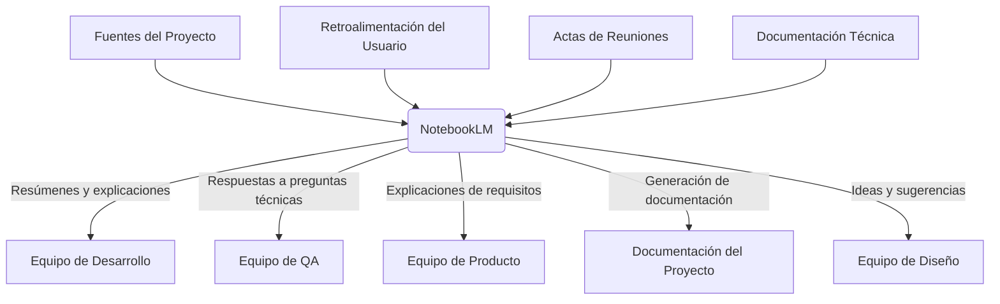

# NotebookLM

## Definición

**NotebookLM** es un asistente de investigación y toma de notas impulsado por IA desarrollado por Google. Permite a los usuarios subir documentos, fuentes y notas, y luego interactuar con ellos mediante lenguaje natural para obtener resúmenes, respuestas a preguntas, generar ideas y crear contenido basado exclusivamente en el material proporcionado.

> [!info] Características principales
> - **Fundamentado en tus fuentes**: Las respuestas se basan únicamente en los documentos que tú subes, reduciendo alucinaciones
> - **Multiformato**: Soporta PDFs, documentos de texto, presentaciones, archivos de audio y más
> - **Conversación natural**: Interactúa mediante preguntas y respuestas en lenguaje natural
> - **Generación de contenido**: Crea resúmenes, guías de estudio, preguntas frecuentes y más
> - **Citas precisas**: Cada respuesta incluye referencias específicas a las fuentes originales
> - **Privacidad enfocada**: Tus datos no se utilizan para entrenar modelos externos
> - **Integración con Google Workspace**: Funciona bien con Google Docs, Slides y otros servicios

## Uso Potencial en el Sistema de Ticketera

En el contexto de nuestro proyecto de sistema de gestión de tickets, NotebookLM podría servir como una herramienta valiosa para el equipo de desarrollo, diseño, producto y calidad, facilitando la comprensión, documentación y colaboración.

### Arquitectura de Uso Potencial

### Fuentes Relevantes para Cargar
- **Documentos de requisitos**: PRDs, especificaciones funcionales, historias de usuario
- **Documentación técnica**: Arquitectura del sistema, especificaciones de API, diagramas de base de datos
- **Actas de reuniones**: Grabaciones y transcripciones de reuniones de planificación, retrospectivas, etc.
- **Código fuente**: Comentarios en el código, documentación inline (si se convierte a formato compatible)
- **Información de dominio**: Documentación sobre la industria de ticketera, mejores prácticas, regulaciones
- **Retroalimentación de usuarios**: Encuestas, entrevistas, reportes de soporte
- **Materiales de diseño**: Guías de estilo, especificaciones de componentes, prototipos descritos

## Beneficios para el Proyecto

### [!success] Mejora en la Comprensión y Onboarding
- **Aceleración del onboarding**: Nuevos miembros del equipo pueden subir documentación del proyecto y obtener respuestas inmediatas
- **Reducción de la curva de aprendizaje**: Comprender rápidamente arquitecturas complejas, flujos de trabajo y decisiones de diseño
- **Consistencia en el conocimiento**: Todos los miembros acceden a la misma información fundamentada en las fuentes oficiales

### [!success] Eficiencia en la Comunicación
- **Reducción de reuniones informativas**: En lugar de programar reuniones para explicar conceptos, los miembros pueden consultar NotebookLM
- **Respuestas rápidas a preguntas técnicas**: Obtener explicaciones detalladas sobre componentes específicos sin interrumpir a desarrolladores
- **Clarificación de requisitos**: Verificar interpretaciones de requisitos contra el documento original

### [!success] Calidad de la Documentación
- **Generación automática de resúmenes**: Crear versiones condensadas de documentos largos para revisión rápida
- **Identificación de lagunas**: Detectar áreas donde la documentación es insuficiente o contradictoria
- **Traducción de lenguaje técnico**: Explicar conceptos complejos en términos más accesibles para stakeholders no técnicos

### [!success] Toma de Decisiones Informada
- **Análisis de retroalimentación**: Procesar entrevistas de usuarios o encuestas para identificar patrones
- **Validación de decisiones**: Verificar si las decisiones propuestas están alineadas con requisitos y mejores prácticas documentadas
- **Investigación de alternativas**: Comparar diferentes enfoques técnicos basándose en documentación disponible

## Casos de Uso Específicos

### 1. Onboarding de Nuevos Desarrolladores
Un nuevo desarrollador se une al equipo y necesita entender rápidamente la arquitectura del backend NestJS. En lugar de esperar una explicación detallada, puede:
1. Subir los documentos de arquitectura, especificaciones de API y código fuente relevante
2. Preguntar: "¿Cómo maneja el sistema la autenticación y autorización de usuarios?"
3. Obtener una respuesta basada en la documentación real del proyecto, con citas específicas
4. Seguir con preguntas más específicas según sea necesario

### 2. Revisión de Requisitos por parte de QA
El equipo de QA necesita diseñar casos de prueba para una nueva funcionalidad de gestión de venues. Puede:
1. Subir el PRD, historias de usuario y especificaciones funcionales relacionadas
2. Preguntar: "¿Cuáles son los criterios de aceptación para la funcionalidad de creación de venues?"
3. Obtener una lista detallada basada en los requisitos originales
4. Usar esa información para diseñar casos de prueba exhaustivos

### 3. Generación de Documentación Técnica
El equipo necesita actualizar la documentación de la API después de un cambio importante. Puede:
1. Subir el código actualizado, comentarios en el código y especificaciones anteriores
2. Pedir: "Genera una descripción actualizada de los endpoints de gestión de eventos"
3. Obtener un borrador que pueda ser revisado y pulido por el equipo técnico
4. Ahorrar tiempo en la redacción inicial de documentación

### 4. Análisis de Retroalimentación de Usuarios
Después de un lanzamiento, el equipo quiere entender los puntos de dolor de los usuarios. Puede:
1. Subir transcripciones de entrevistas de usuarios, encuestas de satisfacción y tickets de soporte
2. Preguntar: "¿Cuáles son los tres problemas más frecuentemente mencionados por los usuarios?"
3. Obtener un resumen basado en los datos reales de retroalimentación
4. Usar esa información para priorizar mejoras en el próximo sprint

## Integración con el Flujo de Trabajo del Equipo

### [!tip] Antes de Reuniones
- Cargar el orden del día y documentos relacionados en NotebookLM
- Usarlo para repasar rápidamente puntos clave antes de la reunión
- Generar preguntas específicas para llevar a la discusión

### [!tip] Durante el Desarrollo
- Mantener actualizada una notebook con la documentación técnica más reciente
- Consultarla cuando surjan dudas sobre implementaciones específicas
- Usarla para explicar conceptos a miembros menos experimentados del equipo

### [!tip] Después de Reuniones
- Subir las actas o grabaciones de reuniones importantes
- Extraer decisiones clave y acciones pendientes
- Generar un resumen ejecutivo para distribuir al equipo

### [!tip] Para Documentación
- Usar NotebookLM como punto de partida para crear o actualizar documentación
- Generar borradores que luego el equipo técnico revise y mejore
- Asegurar que la documentación esté fundamentada en las fuentes reales del proyecto

## Mejores Prácticas de Implementación

### [!tip] Selección y Preparación de Fuentes
- Subir versiones finales y aprobadas de documentos, no borradores de trabajo
- Convertir formatos no soportados (como ciertos tipos de código) a texto plano cuando sea posible
- Eliminar información sensible o confidencial antes de subir (credenciales, datos personales de usuarios, etc.)
- Organizar las fuentes por tema o proyecto para facilitar la consulta

### [!tip] Formulación Efectiva de Preguntas
- Ser específico y contextual en las preguntas
- Incluir detalles relevantes para enfocar la respuesta
- Pedir citas o referencias específicas cuando sea necesario verificar información
- Dividir preguntas complejas en varias más simples si es necesario

### [!tip] Verificación y Validación
- Siempre verificar las respuestas contra las fuentes originales cuando sea crítico
- Usar las citas proporcionadas por NotebookLM para localizar la información exacta
- Contradecirse información importante con múltiples fuentes cuando sea posible
- Recordar que NotebookLM es una herramienta de asistencia, no un reemplazo del pensamiento crítico

### [!tip] Colaboración y Compartición
- Crear notebooks temáticas para diferentes áreas del proyecto (arquitectura, QA, diseño, etc.)
- Compartir enlaces a notebooks específicas con miembros relevantes del equipo
- Mantener un registro de qué fuentes se han cargado en cada notebook para evitar duplicados
- Considerar crear una notebook maestra que enlace a otras más especializadas

## Limitaciones y Consideraciones

### [!warning] Dependencia de la Calidad de las Fuentes
- La calidad de las respuestas depende directamente de la calidad y completitud de las fuentes subidas
- Fuentes incompletas, contradictorias o desactualizadas producirán respuestas poco confiables
- Es necesario mantener actualizadas las fuentes en NotebookLM a medida que evoluciona el proyecto

### [!warning] Alcance Limitado a las Fuentes Proporcionadas
- NotebookLM no puede acceder a información fuera de las fuentes que tú proporcionas
- No sustituye la necesidad de aprender y comprender el proyecto por cuenta propia
- Es complementario, no sustitutivo, de la documentación formal y la comunicación directa

### [!warning] Privacidad y Seguridad de la Información
- Revisar cuidadosamente qué información se sube, especialmente si contiene datos sensibles
- Considerar crear versiones anonimizadas o agregadas de datos sensibles cuando sea necesario
- Establecer políticas claras sobre qué tipos de información pueden subir los miembros del equipo

### [!warning] Sobredependencia y Atrofia de Habilidades
- Usar NotebookLM como ayuda, no como reemplazo del pensamiento crítico y análisis
- Mantener el hábito de leer y comprender la documentación original directamente
- Usarlo para acelerar el comprensión, no para evitar el esfuerzo de aprendizaje necesario

## Glosario de Términos

- **Nota (Notebook)**: Una colección de fuentes y conversaciones relacionadas en NotebookLM
- **Fuente (Source)**: Un documento, archivo o pieza de información que has subido a NotebookLM
- **Respuesta basada en fuentes**: Una respuesta que NotebookLM genera exclusivamente a partir de las fuentes que proporcionaste
- **Cita en línea**: Una referencia específica que NotebookLM incluye en sus respuestas para mostrar exactamente dónde encontró la información
- **Guía de estudio**: Un tipo de contenido que NotebookLM puede generar para ayudar a comprender un tema complejo
- **Preguntas frecuentes (FAQ)**: Otro tipo de contenido que NotebookLM puede crear basado en tus fuentes
- **Resumen**: Una versión condensada de una o más fuentes que NotebookLM puede generar
- **Alucinación**: Cuando una IA genera información falsa o inventada (NotebookLM busca minimizar esto mediante su enfoque en fuentes específicas)
- **Prompt**: La pregunta o instrucción que le das a NotebookLM para obtener una respuesta

## Relación con Otros Conceptos del Sistema

Este recurso se relaciona con varios aspectos de nuestra arquitectura y procesos:

- [[documentacion-de-proyecto]] - Herramienta para crear y mantener documentación técnica y funcional
- [[gestion-del-conocimiento]] - Parte de la estrategia general para capturar y compartir conocimiento institucional
- [[onboarding-de-equipo]] - Facilita la integración rápida de nuevos miembros
- [[revision-de-requisitos]] - Ayuda en la validación y comprensión de requisitos funcionales y no técnicos
- [[retroalimentacion-de-usuarios]] - Facilita el análisis de entrevistas, encuestas y tickets de soporte
- [[comunicacion-equipo]] - Mejora la eficiencia en el intercambio de información entre miembros
- [[aprendizaje-continuo]] - Apoya el desarrollo continuo de habilidades y conocimiento del equipo
- [[control-de-calidad]] - Puede asistir en la creación de casos de prueba y verificación de especificaciones
- [[gestion-de-cambios]] - Ayuda a entender el impacto de modificaciones propuestas revisando documentación relacionada

> [!note] Documento creado siguiendo las mejores prácticas de Obsidian Flavored Markdown
> *Última actualización: 2026-04-27*