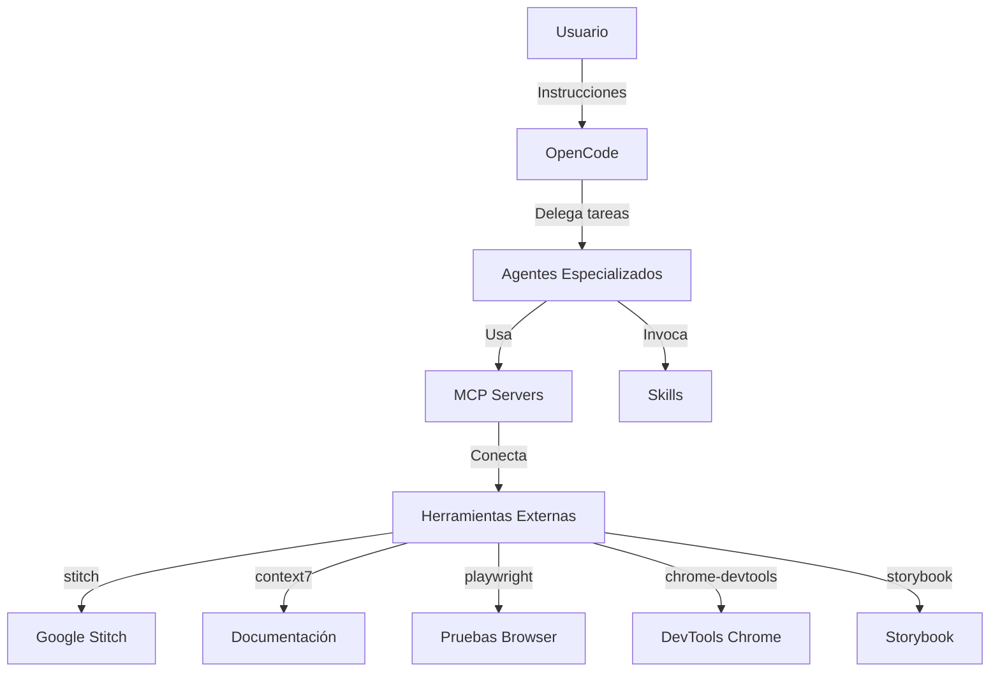

# OpenCode

## Definición

**OpenCode** es una plataforma de desarrollo asistido por IA que funciona como un entorno de agentes autonomous capaz de ejecutar tareas de desarrollo de software complejas. Utiliza modelos de lenguaje para comprender instrucciones, planificar soluciones, escribir código y ejecutar comandos en el entorno del desarrollador.

> [!info] Características principales
> - **Arquitectura basada en agentes**: Múltiples agentes especializados que pueden colaborar o trabajar de forma independiente
> - **Integración con MCP**: Soporte nativo para Model Context Protocol permitiendo conectar herramientas externas
> - **Configuración flexible**: Soporta múltiples proveedores de modelos de IA (OpenRouter, OpenAI, Anthropic, etc.)
> - **Ejecución en terminal**: Opera directamente en el entorno de desarrollo del usuario
> - **Sistema de skills**: Permite extender capacidades mediante skills especializadas

## Configuración del Proyecto

El archivo de configuración principal es `opencode.json` ubicado en la raíz del proyecto. Este archivo define los proveedores de modelos, los MCP activos y los plugins instalados.

### Proveedores de Modelos

```json
{
  "provider": {
    "openrouter": {
      "models": {
        "moonshotai/kimi-k2": {
          "options": {
            "provider": {
              "order": ["baseten"],
              "allow_fallbacks": false
            }
          }
        }
      }
    }
  }
}
```

### Modelo Configurado

| Campo | Valor |
|-------|-------|
| Proveedor | OpenRouter |
| Modelo | moonshotai/kimi-k2 |
| Orden de proveedor | baseten |
| Fallbacks permitidos | No |

### Model Context Protocol (MCP)

El proyecto tiene configurados varios servidores MCP para extender las capacidades de los agentes:

| MCP | Tipo | Descripción |
|-----|------|-------------|
| stitch | remote | Google Stitch para diseño de UI |
| playwright | local | Automatización de pruebas de navegador |
| chrome-devtools | local | Control del navegador Chrome |
| context7 | remote | Documentación de librerías actualizada |
| storybook | remote | Storybook local para testing de componentes |

### Plugins

| Plugin | Función |
|--------|---------|
| opencode-gemini-auth | Autenticación con servicios Gemini |

## Arquitectura de Agentes

OpenCode utiliza un sistema de agentes especializados que pueden ser invocados para diferentes tareas:

### Agentes Disponibles en Este Proyecto

| Agente | Descripción | Uso |
|--------|-------------|-----|
| nest-developer | Desarrollador NestJS especializado | Tareas de backend |
| next-developer | Desarrollador Next.js/React especializado | Tareas de frontend |
| architect | Arquitecto e investigador | Análisis de sistemas |
| doc-writer | Especialista en documentación | Crear/actualizar docs |
| code-reviewer | Revisor de código | Revisar código |
| systems-analyst | Analista de sistemas | Subagente |
| security-officer | Oficial de seguridad | Subagente |
| qa | Control de calidad | Subagente |
| product-owner | Product Owner | Subagente |
| business-analyst | Analista de negocio | Subagente |

### Sistema de Skills

Además de los agentes, OpenCode soporta un sistema de skills que extiende las capacidades disponibles:

```json
"skills": [
  "nestjs-module-generator",
  "defuddle",
  "find-skills",
  "frontend-design",
  "javascript-typescript-jest",
  "json-canvas",
  "next-best-practices",
  "obsidian-bases",
  "obsidian-cli",
  "obsidian-markdown",
  "obsidian-vault",
  "remotion-best-practices",
  "stitch-design",
  "stitch-design-taste",
  "stitch-loop",
  "stitch-ui-design",
  "ui-ux-pro-max"
]
```

## Integración con el Ecosistema del Proyecto

### Flujo de Trabajo



### Relación con Otros Componentes

- [[mcp]] - Model Context Protocol que permite la comunicación con herramientas externas
- [[skills]] - Sistema de habilidades que extiende las capacidades de los agentes
- [[notebooklm]] - Herramienta complementaria para investigación y documentación
- [[sentry]] - Monitoreo de errores integrado en el flujo de desarrollo
- [[railway]] - Plataforma de deployment donde corre el backend
- [[cloudflare-r2]] - Almacenamiento de assets estáticos

## Uso en el Proyecto

### Ejecución de Tareas

OpenCode se utiliza principalmente para:

1. **Desarrollo de funcionalidades**: Los agentes nest-developer y next-developer implementan features en el backend y frontend
2. **Documentación**: El agente doc-writer crea y mantiene la documentación del proyecto
3. **Revisión de código**: code-reviewer analiza el código y sugiere mejoras
4. **Investigación**: El agente architect analiza arquitecturas y resuelve problemas complejos

### Comandos Comunes

| Comando | Descripción |
|---------|-------------|
| `@agente mensaje` | Invoca un agente específico con una tarea |
| `@skill nombre args` | Ejecuta una skill específica |
| `/buscar patrón` | Busca en el codebase |
| `/tarea descripción` | Crea una tarea de seguimiento |

## Mejores Prácticas

### [!tip] Selección de Agente

- Usar `nest-developer` para tareas de backend NestJS
- Usar `next-developer` para tareas de frontend Next.js/React
- Usar `doc-writer` para crear o actualizar documentación
- Usar `code-reviewer` después de implementar features significativas

### [!tip] Formulación de Prompts

- Ser específico sobre el resultado esperado
- Incluir contexto del proyecto cuando sea relevante
- Especificar restricciones o requisitos técnicos
- Indicar si se requiere investigación o solo ejecución

### [!tip] Uso de Skills

- Usar `nestjs-module-generator` para crear nuevos módulos en el backend
- Usar `obsidian-markdown` para crear documentación en Obsidian
- Usar `frontend-design` para diseñar interfaces de usuario

## Limitaciones y Consideraciones

### [!warning] Contexto Limitado

- Los agentes mantienen contexto de la conversación actual
- Para tareas complejas, puede ser necesario dividir en múltiples invocaciones
- El contexto se puede perder en conversaciones muy largas

### [!warning] Verificación Necesaria

- Siempre verificar el código generado por los agentes
- Revisar que las cambios cumplan con los estándares del proyecto
- Validar que las explicaciones técnicas sean correctas

### [!warning] Seguridad

- No exponer credenciales o información sensible en prompts
- Los agentes pueden ejecutar comandos en el sistema
- Revisar los comandos antes de ejecutarlos si hay dudas

## Glosario de Términos

- **Agente**: Un componente de IA especializado en realizar un tipo específico de tarea
- **Skill**: Una habilidad específica que extiende las capacidades de un agente
- **MCP (Model Context Protocol)**: Protocolo que permite comunicación entre agentes y herramientas externas
- **Provider**: Proveedor de modelos de IA (OpenRouter, OpenAI, etc.)
- **Plugin**: Componente que añade funcionalidad adicional a OpenCode
- **Prompt**: La instrucción o descripción de tarea que se le da a un agente

## Referencias Externas

- [OpenCode.ai](https://opencode.ai) - Sitio oficial de la plataforma
- [Documentación de MCP](https://modelcontextprotocol.io) - Protocolo de contexto para modelos
- [OpenRouter](https://openrouter.ai) - Proveedor de modelos unificado

> [!note] Documento creado siguiendo las mejores prácticas de Obsidian Flavored Markdown
> *Última actualización: 2026-04-27*