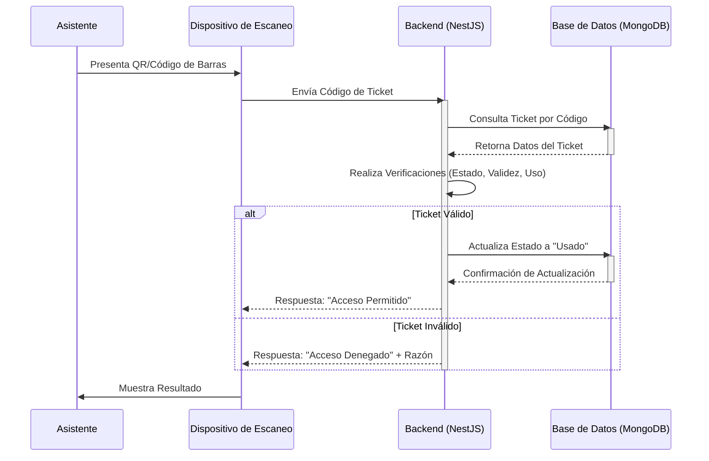

# Procesos de Validación (Tickets)

## Definición

Los **Procesos de Validación de Tickets** se refieren a la serie de pasos y verificaciones que se realizan para confirmar la autenticidad y validez de un [[entradas-e-ticket|e-ticket]] en el punto de acceso a un evento. El objetivo principal es asegurar que solo los asistentes autorizados con entradas válidas puedan ingresar, prevenir el fraude y gestionar el aforo.

## Flujo de Validación

## Verificaciones Clave

1.  **Autenticidad del Código**:
    -   Verificar que el formato del código (QR o de barras) sea correcto.
    -   Decodificar el código para extraer el `ticketId` único.

2.  **Existencia en Base de Datos**:
    -   Consultar la [[base-de-datos-mongodb]] para confirmar que el `ticketId` existe.

3.  **Estado del Ticket**:
    -   **Activo**: El ticket debe estar en estado "activo".
    -   **No Usado**: El ticket no debe haber sido validado previamente.
    -   **No Cancelado**: El ticket no debe haber sido anulado o reembolsado.

4.  **Validez Temporal**:
    -   Verificar que la fecha y hora actual estén dentro del período de validez del ticket (ej. `validFrom` y `validUntil`).
    -   Para tickets con franja horaria, asegurar que el escaneo ocurra en la franja correcta.

5.  **Prevención de Duplicados (Re-escaneo)**:
    -   Registrar el `ticketId` como "usado" inmediatamente después de una validación exitosa para evitar que el mismo ticket sea utilizado múltiples veces.

6.  **Contexto del Evento**:
    -   Confirmar que el ticket corresponde al evento y la fecha/hora correctos que se están validando.

## Consideraciones de Seguridad

-   **Registro de Uso**: Cada intento de validación (exitoso o fallido) debe ser registrado con timestamp, ubicación y dispositivo.
-   **Límites de Intento**: Implementar límites de intentos de validación fallidos para un mismo ticket para prevenir ataques de fuerza bruta.
-   **Modo Offline**: Para puntos de acceso con conectividad intermitente, el dispositivo de escaneo debe poder operar en modo offline y sincronizar los datos de validación una vez que se restablezca la conexión.
-   **Protección contra Fraude**: Las medidas de seguridad deben ser robustas para prevenir la falsificación o duplicación de tickets.

## Implementación Técnica

-   **Backend ([[nestjs]])**: Contiene la lógica principal de validación, interactuando con la [[base-de-datos-mongodb]] para la base de datos.
-   **Dispositivo de Escaneo**: Puede ser una aplicación móvil o un hardware dedicado que se comunica con el backend.
-   **[[seguridad-de-datos]]**: Asegurar que la comunicación entre el scanner y el backend sea segura (HTTPS).

## Relación con Otros Conceptos

- [[entradas-e-ticket]] - La entidad que se valida.
- [[seguridad-de-datos]] - Fundamental para prevenir el fraude.
- [[nestjs]] - Backend que implementa la lógica de validación.
- [[base-de-datos-mongodb]] - Almacena el estado y los datos de los tickets.
- [[eventos]] (I will create this file later if it doesn't exist) - Los tickets se validan para eventos específicos.

> [!note] Documento creado como placeholder.
> *Última actualización: 2026-04-27*