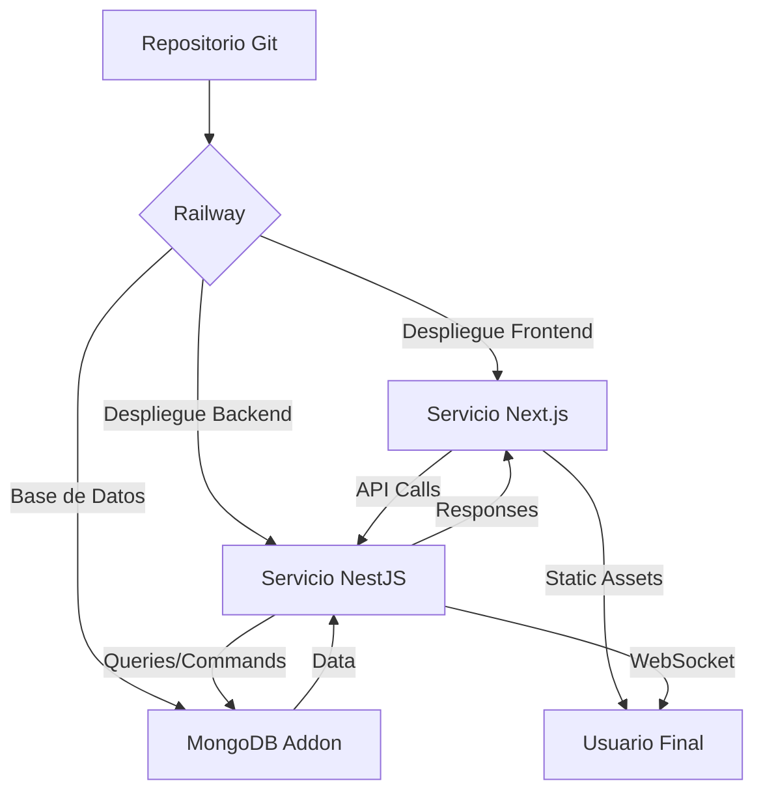

# Railway

## Tabla de contenidos
- [[#Definición]]
- [[#Características principales]]
- [[#Uso en el Sistema de Ticketera]]
  - [[#Arquitectura de Despliegue]]
  - [[#Servicios Desplegados]]
  - [[#Configuración en Railway]]
    - [[#Archivo railway.toml (opcional)]]
    - [[#Configuración vía Dashboard (alternativa)]]
- [[#Beneficios para el Proyecto]]
  - [[#Simplicidad de Despliegue]]
  - [[#Gestión de Base de Datos]]
  - [[#Flujo de Trabajo de Desarrollo]]
  - [[#Escalabilidad y Rendimiento]]
- [[#Integración con Otros Servicios]]
- [[#Mejores Prácticas de Implementación]]
  - [[#Gestión de Entornos]]
  - [[#Seguridad]]
  - [[#Optimización de Costos]]
  - [[#Monitoreo y Mantenimiento]]
- [[#Solución de Problemas Comunes]]
  - [[#Errores de Conexión a Base de Datos]]
  - [[#Fallos en el Despliegue del Frontend]]
  - [[#Problemas de Comunicación entre Servicios]]
- [[#Glosario de Términos]]

## Definición

**Railway.app** es una plataforma de despliegue y alojamiento de aplicaciones que permite desplegar servicios desde repositorios de Git con configuración mínima, proporcionando bases de datos gestionadas, variables de entorno, escalado automático y logs integrados. Está diseñada para simplificar el despliegue de aplicaciones full-stack como nuestro sistema de ticketera.

> [!info] Características principales
> - **Despliegue desde Git**: Conexión directa a repositorios de GitHub/GitLab/Bitbucket
> - **Bases de datos gestionadas**: Addons para PostgreSQL, MongoDB, MySQL, Redis, etc.
> - **Variables de entorno**: Gestión segura y diferenciada por entorno (desarrollo, staging, producción)
> - **Escalado automático**: Ajuste dinámico de recursos según el tráfico
> - **Logs en tiempo real**: Visualización y búsqueda de logs de todos los servicios
> - **Entornos previsuales**: Despliegues automáticos para pull requests
> - **Integración con Docker**: Soporte nativo para Dockerfiles y docker-compose.yml
> - **Dominios personalizados**: Configuración fácil de dominios y SSL

## Uso en el Sistema de Ticketera

En nuestro proyecto, Railway se utiliza para desplegar tanto el frontend ([[nextjs]]) como el backend ([[nestjs]]) junto con la base de datos MongoDB, aprovechando su capacidad para manejar múltiples servicios interconectados.

### Arquitectura de Despliegue



### Servicios Desplegados

#### 1. Frontend ([[nextjs]])
- Servicio desplegado desde el directorio `venta-entradas-v2-frontend`
- Utiliza el Dockerfile existente o buildpack de Node.js
- Puerto expuesto: 3000 (mapeado a dominio público)
- Variables de entorno: `NEXT_PUBLIC_API_URL`, `NEXT_PUBLIC_SENTRY_DSN`, etc.

#### 2. Backend ([[nestjs]])
- Servicio desplegado desde el directorio `venta-entradas-v2-backend`
- Utiliza el Dockerfile existente o buildpack de Node.js
- Puerto expuesto: 3001 (mapeado a dominio público o interno)
- Variables de entorno: `DATABASE_URL`, `JWT_SECRET`, `CLOUDFLARE_R2_*`, etc.

#### 3. Base de Datos ([[base-de-datos-mongodb|MongoDB]])
- Addon de MongoDB gestionado por Railway
- Conexión interna mediante variable de entorno `DATABASE_URL`
- No requiere configuración adicional de red o seguridad

### Configuración en Railway

#### Archivo railway.toml (opcional)

```toml
[build]
  builder = "docker"
  dockerfilePath = "./desarrollo/venta-entradas-v2-backend/Dockerfile"

[deploy]
  restartPolicy = "on_failure"
  healthCheckPath = "/health"
  healthCheckTimeout = 20
  healthCheckInterval = 10
  healthCheckMethod = "GET"

[[services]]
  name = "backend"
  source = "./desarrollo/venta-entradas-v2-backend"
  dockerfilePath = "./Dockerfile"
  internalPort = 3001
  externalPort = 80
  restartPolicy = "on_failure"
  envVars = [
    { key = "DATABASE_URL", from = "mongodb.url" },
    { key = "NODE_ENV", value = "production" }
  ]

[[services]]
  name = "frontend"
  source = "./desarrollo/venta-entradas-v2-frontend"
  dockerfilePath = "./Dockerfile"
  internalPort = 3000
  externalPort = 80
  domain = {
    hostname = "ticketera.example.com"
  }
  envVars = [
    { key = "NEXT_PUBLIC_API_URL", value = "https://backend.up.railway.app" },
    { key = "NODE_ENV", value = "production" }
  ]

[[databases]]
  name = "mongodb"
  plugin = "mongodb"
  plan = "free"
```

#### Configuración vía Dashboard (alternativa)

1. Crear nuevo proyecto en Railway
2. Conectar repositorio Git del proyecto
3. Agregar tres servicios:
   - **Backend**: Desde `desarrollo/venta-entradas-v2-backend`, puerto 3001
   - **Frontend**: Desde `desarrollo/venta-entradas-v2-frontend`, puerto 3000
   - **Base de datos**: Addon de MongoDB (plan gratuito suficiente para desarrollo/staging)
4. Configurar variables de entorno:
   - Para backend: `DATABASE_URL` (viene del addon MongoDB), `JWT_SECRET`, `CLOUDFLARE_R2_ACCESS_KEY_ID`, etc.
   - Para frontend: `NEXT_PUBLIC_API_URL` (URL del servicio backend), `NEXT_PUBLIC_SENTRY_DSN`
5. Establecer dependencias: El frontend depende del backend para llamadas API
6. Configurar dominio personalizado (opcional)

## Beneficios para el Proyecto

### [!success] Simplicidad de Despliegue
-   **Despliegue con un clic**: Conexión a repositorio y despliegue automático
-   **Sin gestión de servidores**: Railway maneja la infraestructura subyacente
-   **Rollbacks fáciles**: Volver a despliegues anteriores con un clic
-   **Entornos aislados**: Despliegues separados para desarrollo, staging y producción

### [!success] Gestión de Base de Datos
-   **Base de datos gestionada**: Copias de seguridad automáticas, actualizaciones, parches
-   **Escalado sencillo**: Aumentar recursos de la base de datos según necesidad
-   **Conexión segura**: Acceso interno entre servicios sin exposición pública
-   **Variables de entorno automáticas**: `DATABASE_URL` proporcionada por el addon

### [!success] Flujo de Trabajo de Desarrollo
-   **Entornos de vista previa**: Despliegues automáticos para cada pull request
-   **Revisión de cambios**: Probar funcionalidad en entorno idéntico a producción
-   **Integración continua**: Despliegue automático al mergear en rama principal
-   **Logs centralizados**: Ver logs de todos los servicios en un solo lugar

### [!success] Escalabilidad y Rendimiento
-   **Escalado horizontal**: Aumentar instancias de servicio según carga
-   **Escalado vertical**: Aumentar CPU/RAM de instancias individuales
-   **Distribución global**: Opciones de despliegue en múltiples regiones
-   **Optimización de recursos**: Pagar solo por lo que se utiliza

## Integración con Otros Servicios

Este método de despliegue se relaciona con varios aspectos de nuestra arquitectura:

- [[docker]] - Base para los servicios desplegados en Railway
- [[variables-de-entorno]] - Gestión segura de configuración en diferentes entornos
- [[integracion-con-backend]] - Cómo el frontend se comunica con el backend desplegado
- [[base-de-datos-mongodb]] - Uso del addon gestionado de MongoDB
- [[cloudflare-r2]] - Configuración de credenciales para almacenamiento de objetos
- [[sentry]] - Monitoreo de errores en entornos de producción
- [[ci-cd]] - Flujo de integración y despliegue continuo

## Mejores Prácticas de Implementación

> [!tip] Gestión de Entornos
> - Use proyectos separados en Railway para desarrollo, staging y producción
> - Mantenga consistencia en nombres de servicios y variables de entorno
> - Use ramas de Git largas para entornos de staging (ej: `staging`)
> - Proteja el entorno de producción con aprobaciones requeridas para despliegue

> [!tip] Seguridad
> - Nunca almacene secrets en el repositorio; use variables de entorno de Railway
> - Rotar regularmente claves de API (JWT, Cloudflare R2, etc.)
> - Limite permisos de la base de datos del addon MongoDB
> - Use HTTPS forzado para todos los dominios personalizados
> - Revise periódicamente los logs de acceso en busca de anomalías

> [!tip] Optimización de Costos
> - Comience con el plan gratuito de Railway para desarrollo y testing
> - Monitoree el uso de recursos (horas de servicio, almacenamiento de BD)
> - Use el plan "Hobby" para staging y producción ligera
> - Considere el plan "Professional" solo cuando sea necesario escalar
> - Apague servicios no utilizados en entornos de desarrollo

> [!tip] Monitoreo y Mantenimiento
> - Configure alertas de Railway para uso elevado de recursos
> - Revise los logs diariamente en busca de errores o patrones inusuales
> - Use la integración con Sentry para seguimiento de errores en producción
> - Programe revisiones mensuales de dependencias y actualizaciones de seguridad
> - Mantenga documentación actualizada del proceso de despliegue

## Solución de Problemas Comunes

> [!warning] Errores de Conexión a Base de Datos
> - **Síntoma**: El backend falla al iniciar con errores de conexión MongoDB
> - **Solución**:
>   1. Verificar que el addon de MongoDB esté correctamente vinculado al servicio backend
>   2. Confirmar que la variable de entorno `DATABASE_URL` esté presente y correcta
>   3. Revisar los logs del addon de MongoDB en busca de problemas de servicio
>   4. Asegurarse de que no haya límites de conexión excedidos

> [!warning] Fallos en el Despliegue del Frontend
> - **Síntoma**: El servicio frontend falla al build o al iniciar
> - **Solución**:
>   1. Verificar que el Dockerfile o buildpack sea compatible con la versión de Node.js
>   2. Confirmar que todas las dependencias estén en `package.json`
>   3. Revisar los logs de build para errores de compilación de TypeScript o Next.js
>   4. Asegurarse de que las variables de entorno `NEXT_PUBLIC_*` estén definidas

> [!warning] Problemas de Comunicación entre Servicios
> - **Síntoma**: El frontend no puede alcanzar el backend (errores CORS o timeout)
> - **Solución**:
>   1. Verificar que el servicio backend esté en estado "Running"
>   2. Confirmar que el puerto interno del backend esté correctamente expuesto (3001)
>   3. Usar la URL interna de Railway (ej: `https://backend.up.railway.app`) en lugar de localhost
>   4. Revisar la configuración de CORS en el backend NestJS
>   5. Verificar que no haya firewalls o reglas de red bloqueando la comunicación

## Glosario de Términos

- **Addon**: Servicio gestionado adicional en Railway (como bases de datos, colas, cachés)
- **Entorno**: Instancia aislada de despliegue (desarrollo, staging, producción)
- **Buildpack**: Scripts automatizados que detectan y construyen aplicaciones sin Dockerfile
- **Dockerfile**: Archivo de texto que contiene instrucciones para construir una imagen Docker
- **Variable de entorno**: Par clave-valor que configura el comportamiento de la aplicación en tiempo de ejecución
- **Despliegue continuo (CD)**: Automatización de la liberación de cambios a producción
- **Entorno de vista previa**: Despliegue temporal asociado a un pull request para revisión
- **Health check**: Endpoint que indica si un servicio está funcionando correctamente
- **Rollback**: Revertir a un estado anterior de despliegue
- **Scaling horizontal**: Aumentar el número de instancias de un servicio
- **Scaling vertical**: Aumentar los recursos (CPU/RAM) de una instancia individual

> [!note] Documento creado siguiendo las mejores prácticas de Obsidian Flavored Markdown
> *Última actualización: 2026-04-27*