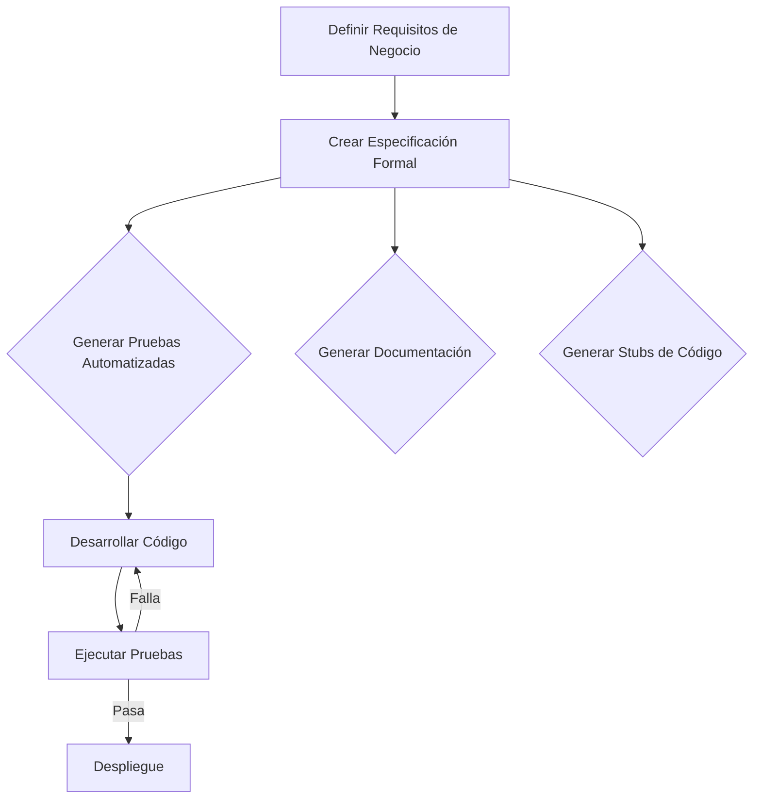

# SDD (Specification-Driven Development)

## Definición

**SDD** (Specification-Driven Development, o Desarrollo Guiado por Especificación) es una metodología de desarrollo de software que enfatiza la creación de especificaciones claras, concisas y ejecutables como el punto de partida para el desarrollo. A diferencia de [[tdd|TDD]] (que se enfoca en pruebas unitarias) y [[bdd|BDD]] (que se enfoca en el comportamiento), SDD busca definir el "qué" del sistema de manera formal y verificable antes de pasar al "cómo".

SDD a menudo se superpone y complementa a BDD, utilizando las especificaciones como la fuente de verdad para la generación de código, pruebas y documentación.

## Principios Clave

-   **Especificaciones como Fuente de Verdad**: Las especificaciones son el artefacto central que guía todo el proceso de desarrollo.
-   **Claridad y Precisión**: Las especificaciones deben ser inequívocas y comprensibles tanto para roles técnicos como de negocio.
-   **Ejecutabilidad**: Las especificaciones deben ser lo suficientemente detalladas como para ser convertidas en pruebas automatizadas o incluso en código.
-   **Colaboración**: Fomenta la colaboración entre stakeholders para definir las especificaciones.
-   **Automatización**: Busca automatizar la generación de pruebas, documentación y, en algunos casos, código a partir de las especificaciones.

## Importancia y Beneficios en el Proyecto

La implementación de SDD en nuestro sistema de ticketera podría ofrecer varios beneficios, especialmente para la gestión de la [[api-rest-especificacion|API REST]] y la lógica de negocio compleja:

-   **Reducción de Ambigüedad**: Asegura que todos los miembros del equipo tengan un entendimiento común de lo que el sistema debe hacer.
-   **Mejora de la Calidad**: Al definir claramente las expectativas, se reduce la probabilidad de errores y retrabajos.
-   **Documentación Consistente**: Las especificaciones pueden ser la base para generar documentación técnica y de usuario de forma automática.
-   **Desarrollo Acelerado**: Al tener especificaciones claras, el desarrollo puede ser más rápido y con menos interrupciones.
-   **Facilita la Integración**: Especialmente útil para la integración de APIs, donde la especificación actúa como un contrato.

## Flujo de Trabajo con SDD

## Integración con Otros Conceptos

-   **[[bdd|BDD]]**: SDD puede utilizar escenarios BDD (Gherkin) como una forma de especificación ejecutable.
-   **[[api-rest-especificacion|Especificación de API REST]]**: Herramientas como OpenAPI/Swagger son ejemplos de especificaciones formales que pueden guiar el desarrollo.
-   **[[calidad-de-codigo|Calidad de Código]]**: Las especificaciones claras contribuyen a un código de mayor calidad.
-   **[[ci-cd|CI/CD]]**: Las pruebas generadas a partir de especificaciones se integran en el pipeline de CI/CD.
-   **[[documentacion-de-proyecto|Documentación de Proyecto]]**: SDD puede automatizar la generación de documentación.

## Herramientas Comunes para SDD

-   **OpenAPI/Swagger**: Para especificar APIs RESTful.
-   **JSON Schema**: Para validar la estructura de datos.
-   **Herramientas de Generación de Código**: Que pueden crear stubs de clientes o servidores a partir de una especificación.

## Glosario de Términos

-   **Especificación**: Una descripción detallada y formal del comportamiento o la estructura de un sistema.
-   **Contrato**: Un acuerdo formal sobre cómo dos componentes o sistemas interactuarán.
-   **OpenAPI**: Un formato de descripción de API estándar.

## Relación con Otros Conceptos del Sistema

- [[bdd]] - Metodología complementaria.
- [[api-rest-especificacion]] - Un tipo de especificación clave.
- [[calidad-de-codigo]] - SDD contribuye a la calidad.
- [[documentacion-de-proyecto]] - SDD puede automatizar la documentación.

> [!note] Documento creado siguiendo las mejores prácticas de Obsidian Flavored Markdown
> *Última actualización: 2026-04-27*