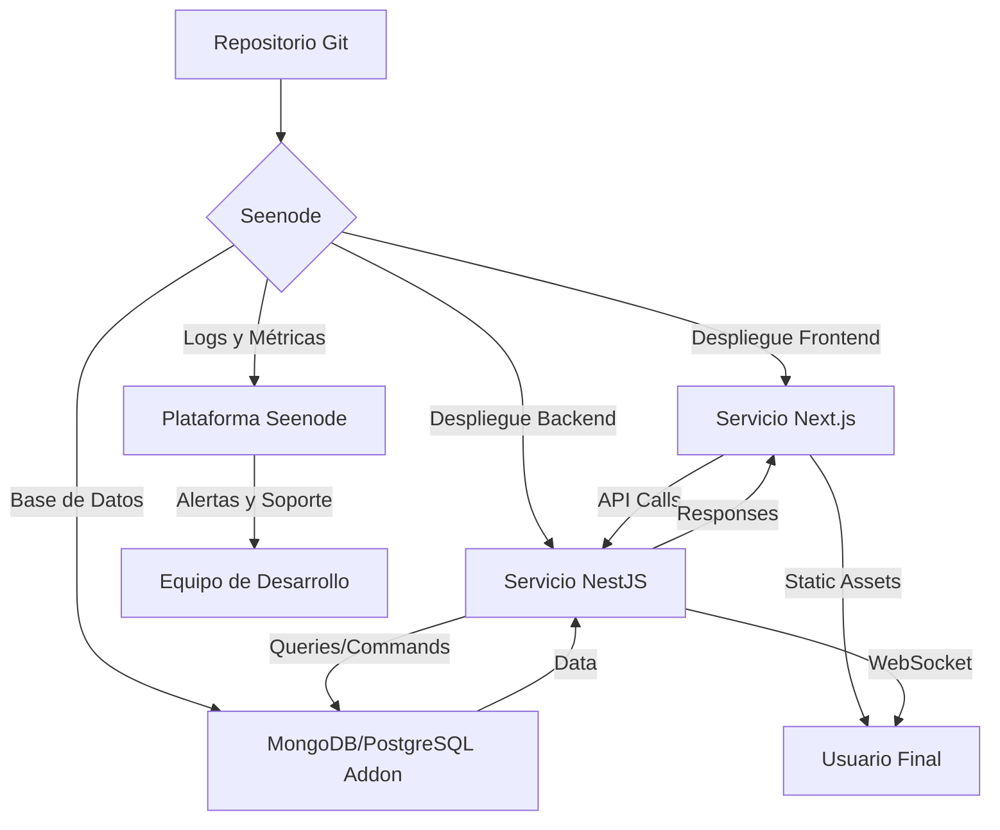

---
# Seenode

## Definición

**Seenode** es una plataforma de plataforma como servicio (PaaS) que permite desplegar aplicaciones desde repositorios de Git con configuración mínima, proporcionando bases de datos gestionadas, escalado automático, logs centralizados y redes privadas. Se destaca por su modelo de precios sin cargos por asiento y su enfoque en desarrolladores con soporte en tiempo real.

> [!info] Características principales
> - **Despliegue desde Git**: Conexión directa a repositorios de GitHub/GitLab
> - **Bases de datos gestionadas**: Addons para PostgreSQL y MySQL
> - **Escalado automático**: Ajuste dinámico de recursos (horizontal y vertical)
> - **Logs centralizados**: Salida de build, runtime y request logs en un solo lugar (14 días de retención)
> - **Redes privadas**: Comunicación interna entre servicios sin exposición pública
> - **Sin cargos por asiento**: Precio basado únicamente en recursos utilizados, no en número de miembros del equipo
> - **Despliegues cero downtime**: Nuevas versiones se despliegan sin dropping de conexiones
> - **Soporte en tiempo real**: Chat en vivo con desarrolladores que construyeron la plataforma
> - **Compatibilidad multi-lenguaje**: Soporte nativo para Node.js, Python, Go, Elixir y más
> - **Dominios personalizados**: Configuración fácil de dominios y SSL incluidos

## Uso en el Sistema de Ticketera

En nuestro proyecto, Seenode se utiliza para desplegar tanto el frontend ([[venta-entradas-v2-frontend|Next.js]]) como el backend ([[venta-entradas-v2-backend|NestJS]]) junto con la base de datos MongoDB (o PostgreSQL/MySQL si optamos por cambiar), aprovechando su capacidad para manejar múltiples servicios interconectados con redes privadas.

### Arquitectura de Despliegue

### Servicios Desplegados

#### 1. Frontend (Next.js)
- Servicio desplegado desde el directorio `desarrollo/venta-entradas-v2-frontend`
- Detección automática de runtime (Node.js)
- Puerto expuesto: 3000 (mapeado a dominio público con SSL)
- Variables de entorno: `NEXT_PUBLIC_API_URL`, `NEXT_PUBLIC_SENTRY_DSN`, etc.

#### 2. Backend (NestJS)
- Servicio desplegado desde el directorio `desarrollo/venta-entradas-v2-backend`
- Detección automática de runtime (Node.js)
- Puerto expuesto: 3001 (mapeado a dominio público o interno)
- Variables de entorno: `DATABASE_URL`, `JWT_SECRET`, `CLOUDFLARE_R2_*`, etc.

#### 3. Base de Datos
- **Opción 1**: MongoDB (si mantenemos nuestra elección actual)
  - Addon de MongoDB gestionado por Seenode
- **Opción 2**: PostgreSQL/MySQL (alternativa)
  - Addon gestionado de PostgreSQL o MySQL
- Conexión interna mediante variable de entorno `DATABASE_URL`
- No requiere configuración adicional de red o seguridad

### Configuración en Seenode

#### Configuración vía Dashboard (método recomendado)
1. Crear nuevo proyecto en Seenode
2. Conectar repositorio Git del proyecto
3. Agregar tres servicios:
   - **Backend**: Desde `desarrollo/venta-entradas-v2-backend`
   - **Frontend**: Desde `desarrollo/venta-entradas-v2-frontend`
   - **Base de datos**: Addon de MongoDB (o PostgreSQL/MySQL)
4. Configurar variables de entorno:
   - Para backend: `DATABASE_URL` (viene del addon de base de datos), `JWT_SECRET`, `CLOUDFLARE_R2_ACCESS_KEY_ID`, etc.
   - Para frontend: `NEXT_PUBLIC_API_URL` (URL del servicio backend), `NEXT_PUBLIC_SENTRY_DSN`
5. Establecer dependencias: El frontend depende del backend para llamadas API
6. Configurar dominio personalizado (opcional, SSL incluido)
7. Ajustar recursos según necesidad (CPU/RAM para cada servicio)

#### Características de Despliegue
- **Detección automática de runtime**: No se requiere Dockerfile ni configuración de build
- **Buildpacks inteligentes**: Seenode detecta el lenguaje/framework y crea contenedores optimizados
- **Despliegue continuo**: Redploy automático al hacer push a la rama configurada
- **Vistas previas**: Despliegues automáticos para pull requests (disponible en planes superiores)
- **Variables de entorno seguras**: Almacenamiento cifrado de secrets y configuración

## Beneficios para el Proyecto

> [!success] Simplicidad de Despliegue
> - **Despliegue en minutos**: Conexión a repositorio y despliegue automático en ~4 minutos
> - **Sin conocimiento de Docker**: No se requiere Dockerfile ni conocimiento de contenedores
> - **Rollbacks fáciles**: Volver a despliegues anteriores con un clic
> - **Entornos aislados**: Despliegues separados para desarrollo, staging y producción mediante proyectos

> [!success] Arquitectura Optimizada
> - **Redes privadas por defecto**: Los servicios se comunican internamente sin exposición pública
> - **Conexiones persistentes**: WebSockets, SSE y pools de base de datos permanecen abiertos
> - **Escalado flexible**: Añadir instancias (horizontal) o aumentar recursos (vertical) según necesidad
> - **Distribución global**: Opciones de despliegue en múltiples regiones para reducir latencia

> [!success] Eficiencia de Costos
> - **Sin cargos por equipo**: Ahorro significativo en equipos grandes (ej: $38/mes por miembro vs competidores)
> - **Precios transparentes**: Facturación diaria basada en recursos utilizados
> - **Prueba gratuita de 7 días**: Evaluación sin compromiso antes de comprometerse
> - **Optimización de recursos**: Pagar solo por lo que se utiliza, sin sobre-provisionamiento

> [!success] Soporte y Experiencia de Desarrollador
> - **Soporte en tiempo real**: Chat en vivo con ingenieros que construyeron la plataforma
> - **Depuración colaborativa**: Los desarrolladores de Seenode saltan directamente a ayudar con problemas
> - **Logs centralizados**: Build output, runtime y request logs en un solo lugar
> - **Métricas en tiempo real**: Visualización de uso de CPU, memoria, tráfico y más

## Integración con Otros Servicios

Este método de despliegue se relaciona con varios aspectos de nuestra arquitectura:

- [[Buildpacks]] - Base para la detección automática de runtime y construcción de contenedores
- [[Variables-de-entorno]] - Gestión segura de configuración en diferentes entornos
- [[Integración-con-backend]] - Cómo el frontend se comunica con el backend desplegado
- [[Base-de-datos]] - Uso del addon gestionado de base de datos (MongoDB/PostgreSQL/MySQL)
- [[Cloudflare-R2]] - Configuración de credenciales para almacenamiento de objetos
- [[Sentry]] - Monitoreo de errores en entornos de producción
- [[CI-CD]] - Flujo de integración y despliegue continuo
- [[Redes-privadas]] - Comunicación segura entre servicios sin exposición pública

## Mejores Prácticas de Implementación

> [!tip] Gestión de Entornos y Proyectos
> - Use proyectos separados en Seenode para desarrollo, staging y producción
> - Mantenga consistencia en nombres de servicios y variables de entorno
> - Aproveche las vistas previas para pull requests (si está disponible en su plan)
> - Proteja el entorno de producción con revisiones requeridas antes de despliegue

> [!tip] Seguridad
> - Nunca almacene secrets en el repositorio; use variables de entorno de Seenode
> - Rotar regularmente claves de API (JWT, Cloudflare R2, etc.)
> - Aproveche las redes privadas para comunicación segura entre servicios
> - Use HTTPS forzado para todos los dominios personalizados (SSL incluido por defecto)
> - Revise periódicamente los logs de acceso en busca de anomalías

> [!tip] Optimización de Costos
> - Comience con el plan gratuito de Seenode para desarrollo y testing
> - Monitoree el uso de recursos (horas de servicio, almacenamiento de base de datos)
> - Ajuste los recursos de cada servicio según el uso real (evite sobre-provisionamiento)
> - Considere el plan estándar solo cuando sea necesario escalar recursos
> - Apague servicios no utilizados en entornos de desarrollo

> [!tip] Monitoreo y Mantenimiento
> - Configure notificaciones para uso elevado de recursos
> - Revise los logs diariamente en busca de errores o patrones inusuales
> - Use la integración con Sentry para seguimiento de errores en producción
> - Programe revisiones mensuales de dependencias y actualizaciones de seguridad
> - Mantenga documentación actualizada del proceso de despliegue
> - Aproveche el soporte en tiempo real para resolución rápida de problemas

## Solución de Problemas Comunes

> [!warning] Errores de Detección de Runtime
> - **Síntoma**: El servicio falla al desplegarse con error de runtime no detectado
> - **Solución**:
>   1. Verificar que el repositorio tenga un archivo `package.json`, `requirements.txt`, `go.mod`, o `mix.exs` según el lenguaje
>   2. Confirmar que las dependencias estén correctamente listadas
>   3. Añadir un archivo `seenode.toml` para especificar el build y start commands manualmente si es necesario
>   4. Contactar al soporte en tiempo real para asistencia inmediata

> [!warning] Problemas de Conexión a Base de Datos
> - **Síntoma**: El backend falla al iniciar con errores de conexión a la base de datos
> - **Solución**:
>   1. Verificar que el addon de base de datos esté correctamente vinculado al servicio backend
>   2. Confirmar que la variable de entorno `DATABASE_URL` esté presente y correcta
>   3. Revisar los logs del addon de base de datos en busca de problemas de servicio
>   4. Asegurarse de que no haya límites de conexión excedidos
>   5. Verificar que la red privada esté funcionando correctamente entre servicios

> [!warning] Fallos en el Despliegue del Frontend
> - **Síntoma**: El servicio frontend falla al build o al iniciar
> - **Solución**:
>   1. Verificar que el proyecto tenga un archivo `package.json` válido
>   2. Confirmar que todas las dependencias estén en `package.json`
>   3. Revisar los logs de build para errores de compilación de TypeScript o Next.js
>   4. Asegurarse de que las variables de entorno `NEXT_PUBLIC_*` estén definidas
>   5. Verificar que el framework sea compatible con los buildpacks de Seenode

> [!warning] Problemas de Comunicación entre Servicios
> - **Síntoma**: El frontend no puede alcanzar el backend (errores de timeout o conexión rechazada)
> - **Solución**:
>   1. Verificar que el servicio backend esté en estado "Running"
>   2. Confirmar que el puerto interno del backend esté correctamente expuesto (3001)
>   3. Usar la URL interna de Seenode (ej: `https://backend-service-name.project-name.seenode.dev`) en lugar de localhost
>   4. Revisar la configuración de CORS en el backend NestJS
>   5. Verificar que las redes privadas estén configuradas correctamente entre los servicios
>   6. Confirmar que no haya firewalls o reglas de red bloqueando la comunicación

## Glosario de Términos

- **Buildpack**: Scripts automatizados que detectan el runtime de una aplicación y crean contenedores de producción sin requerir Dockerfile
- **Runtime**: El entorno de ejecución de una aplicación (Node.js, Python, Go, etc.)
- **Red privada**: Red aislada donde los servicios pueden comunicarse sin exposición a internet público
- **Despliegue continuo (CD)**: Automatización de la liberación de cambios a producción al hacer push al repositorio
- **Variable de entorno**: Par clave-valor que configura el comportamiento de la aplicación en tiempo de ejecución
- **Escalado horizontal**: Aumentar el número de instancias de un servicio para manejar más tráfico
- **Escalado vertical**: Aumentar los recursos (CPU/RAM) de una instancia individual
- **Zero-downtime deploy**: Despliegue de nueva versión sin dropping de conexiones activas
- **Long-lived connection**: Conexión que permanece abierta durante períodos extensos (WebSockets, pools de BD, etc.)
- **Logs centralizados**: Sistema que recopila logs de build, runtime y requests en una ubicación unificada
- **Vista previa de despliegue**: Despliegue temporal asociado a un pull request para revisión antes de merge
- **Addon**: Servicio gestionado adicional en Seenode (como bases de datos, colas, cachés)
- **Detección automática de runtime**: Capacidad de Seenode para identificar el lenguaje/framework sin configuración explícita
- **Precio por recurso**: Modelo de facturación basado en CPU, memoria, almacenamiento y uso, no en número de usuarios
- **Soporte en tiempo real**: Asistencia inmediata mediante chat con ingenieros de la plataforma
- **SSL incluido**: Certificados SSL/TLS proporcionados automáticamente para dominios personalizados
- **Proyecto**: Contenedor lógico en Seenode para agrupar servicios relacionados (por entorno, cliente, etc.)

## Relación con Otros Conceptos del Sistema

Este método de despliegue se relaciona con varios aspectos de nuestra arquitectura:

- [[Railway]] - Plataforma alternativa de despliegue con modelo de precios diferente
- [[Docker]] - Tecnología subyacente que Seenode abstracta mediante buildpacks
- [[Variables-de-entorno]] - Gestión segura de configuración en diferentes entornos
- [[Integración-con-backend]] - Cómo el frontend se comunica con el backend desplegado
- [[Base-de-datos-MongoDB]] - Uso del addon gestionado de MongoDB (opción actual)
- [[Base-de-datos-PostgreSQL]] - Alternativa de base de datos gestionada disponible en Seenode
- [[Cloudflare-R2]] - Configuración de credenciales para almacenamiento de objetos
- [[Sentry]] - Monitoreo de errores en entornos de producción
- [[CI-CD]] - Flujo de integración y despliegue continuo
- [[Redes-privadas]] - Comunicación segura entre servicios sin exposición pública
- [[Arquitectura-de-microservicios]] - Patrón arquitectónico que Seenode facilita naturalmente
- [[Observabilidad]] - Combinación de logs, métricas y tracing para entender el comportamiento del sistema
- [[Experiencia-de-Desarrollador]] - Enfoque en reducir fricción en el proceso de despliegue y depuración

## Comparación con Alternativas

| Característica | Seenode | Railway | Render | Vercel |
|----------------|---------|---------|--------|--------|
| **Despliegue desde Git** | ✅ Sí | ✅ Sí | ✅ Sí | ✅ Sí (optimizado para frontend) |
| **Detección automática de runtime** | ✅ Sí | ✅ Sí | ✅ Sí | ✅ Sí (JS/TS) |
| **Requiere Dockerfile** | ❌ No | ⚠️ Opcional | ⚠️ Opcional | ❌ No |
| **Bases de datos gestionadas** | ✅ PostgreSQL/MySQL | ✅ PostgreSQL/MongoDB/MySQL | ✅ PostgreSQL/MySQL/Redis | ❌ No (enfocado en frontend) |
| **Redes privadas** | ✅ Sí | ✅ Sí | ✅ Sí | ⚠️ Limitado |
| **Sin cargos por asiento** | ✅ Sí | ❌ Sí (en planes pagos) | ❌ Sí | ❌ Sí |
| **Logs centralizados** | ✅ Sí (14 días) | ✅ Sí | ✅ Sí | ✅ Sí |
| **WebSockets y conexiones persistentes** | ✅ Sí | ✅ Sí | ✅ Sí | ⚠️ Limitado |
| **Despliegues cero downtime** | ✅ Sí | ✅ Sí | ✅ Sí | ✅ Sí |
| **Soporte en tiempo real** | ✅ Sí (desarrolladores de la plataforma) | ❌ No (soporte estándar) | ❌ No | ❌ No |
| **Precio inicial** | 💰 Bajo (prueba 7 días) | 💰 Bajo (plan gratuito) | 💰 Bajo (plan gratuito) | 💰 Bajo (plan gratuito) |
| **Modelo de precios** | 💰 Por recurso | 💰 Por recurso + asiento | 💰 Por recurso | 💰 Por recurso + uso |
| **Presencia en LatAm** | ✅ Bueno (infra global) | ✅ Bueno | Varía por región | ✅ Bueno |
| **Integración con Cloudflare** | ✅ Posible | ✅ Posible | ✅ Posible | ✅ Posible |
| **Worker jobs/background processes** | ✅ Sí | ✅ Sí | ✅ Sí | ❌ No (enfocado en HTTP) |

> [!note] Documento creado siguiendo las mejores prácticas de Obsidian Flavored Markdown
> *Última actualización: 2026-04-27*