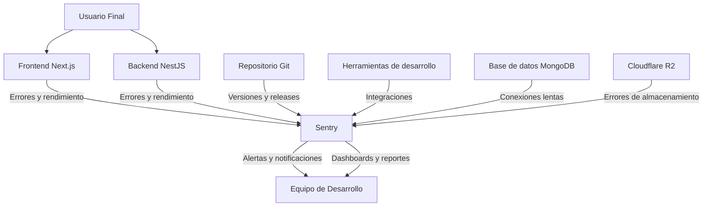

# Sentry

## Tabla de contenidos
- [[#Definición]]
- [[#Características principales]]
- [[#Uso en el Sistema de Ticketera]]
  - [[#Arquitectura de Monitoreo]]
  - [[#Integración en el Frontend (Next.js)]]
    - [[#Configuración básica]]
    - [[#Uso en componentes y páginas]]
  - [[#Integración en el Backend (NestJS)]]
    - [[#Configuración del módulo]]
    - [[#Uso en servicios y controladores]]
- [[#Monitoreo de Rendimiento (APM)]]
  - [[#Backend - Rastreo de transacciones]]
  - [[#Frontend - Rastreo de interacciones]]
- [[#Beneficios para el Proyecto]]
  - [[#Detección Temprana de Problemas]]
  - [[#Mejora de la Experiencia de Usuario]]
  - [[#Eficiencia del Equipo de Desarrollo]]
  - [[#Toma de Decisiones Basada en Datos]]
- [[#Integración con Otros Servicios]]
- [[#Mejores Prácticas de Implementación]]
  - [[#Configuración de DSNs y Seguridad]]
  - [[#Tasas de Muestreo Adecuadas]]
  - [[#Enriquecimiento de Contexto]]
  - [[#Filtrado y Enriquecimiento de Eventos]]
  - [[#Alertas y Notificaciones]]
  - [[#Gestión de Lanzamientos y Versiones]]
  - [[#Integración con Flujo de Trabajo]]
- [[#Solución de Problemas Comunes]]
  - [[#Volumen Alto de Eventos]]
  - [[#Información Sensible en Errores]]
  - [[#Falta de Contexto para Depuración]]
  - [[#Impacto en Rendimiento]]
- [[#Glosario de Términos]]

## Definición

**Sentry** es una plataforma de monitoreo de errores y rendimiento que ayuda a los desarrolladores a diagnosticar, solucionar y optimizar el rendimiento de sus aplicaciones en tiempo real. Proporciona visibilidad completa sobre excepciones, transacciones y problemas de rendimiento en aplicaciones frontend y backend.

> [!info] Características principales
> - **Monitoreo de errores**: Captura y agrupación automática de excepciones y errores
> - **Monitoreo de rendimiento**: Rastreo de transacciones y métricas de rendimiento ([[APM]])
> - **Soporte multiplataforma**: Integración con JavaScript/TypeScript, Python, Node.js, Java, .NET, y más
> - **Contexto rico**: Información detallada sobre el estado de la aplicación cuando ocurre un error
> - **Alertas inteligentes**: Notificaciones basadas en umbrales, tendencias y regresiones
> - **Integración con flujos de trabajo**: Conexión con GitHub, Jira, Slack, y otras herramientas de desarrollo
> - **Gestión de lanzamientos**: Vinculación de errores a versiones específicas de la aplicación
> - **Protección de datos**: Opciones para excluir información sensible y cumplir con regulaciones

## Uso en el Sistema de Ticketera

En nuestro sistema de gestión de tickets, Sentry se utiliza para monitorear tanto el frontend ([[Next.js]]) como el backend ([[NestJS]]), proporcionando visibilidad completa sobre la salud de la aplicación en todos los entornos.

### Arquitectura de Monitoreo



### Integración en el Frontend (Next.js)

#### Configuración básica

```typescript
// lib/sentry.init.ts
import * as Sentry from '@sentry/nextjs';

Sentry.init({
  dsn: process.env.NEXT_PUBLIC_SENTRY_DSN,
  
  // Configuración de entorno
  environment: process.env.NODE_ENV,
  
  // Tasas de muestreo
  tracesSampleRate: process.env.NODE_ENV === 'production' ? 0.1 : 1.0, // 10% en prod, 100% en dev
  
  // Opciones de filtrado
  ignoreErrors: [
    // Errores comunes de navegador que no queremos rastrear
    'Non-Error exception thrown with non-Error value',
    'ResizeObserver loop limit exceeded',
  ],
  
  // Antes de enviar el evento
  beforeSend: (event, hint) => {
    // Excluir información sensible
    if (process.env.NODE_ENV === 'production') {
      // Eliminar datos de formularios sensibles
      if (event.request?.data?.includes('password') ||
          event.request?.data?.includes('token') ||
          event.request?.data?.includes('creditCard')) {
        return null;
      }
    }
    return event;
  },
  
  // Adjuntar información de versión
  release: process.env.NEXT_PUBLIC_SENTRY_RELEASE || 'unknown',
});
```

#### Uso en componentes y páginas

```typescript
// Ejemplo de captura manual de errores
import * as Sentry from '@sentry/nextjs';

async function handleFormSubmit(formData: FormData) {
  try {
    const response = await fetch('/api/submit-ticket', {
      method: 'POST',
      body: formData
    });
    
    if (!response.ok) {
      throw new Error(`Error ${response.status}: ${response.statusText}`);
    }
    
    return await response.json();
  } catch (error) {
    // Reportar error manualmente a Sentry
    Sentry.captureException(error);
    throw error; // Re-lanzar para manejo en UI
  }
}

// Ejemplo de agregar contexto
import * as Sentry from '@sentry/nextjs';

function loadUserProfile(userId: string) {
  // Añadir contexto que será incluido con cualquier error posterior
  Sentry.setContext('profile', {
    userId,
    lastLoaded: new Date().toISOString(),
  });
  
  // También podemos añadir breadcrumbs
  Sentry.addBreadcrumb({
    category: 'ui.click',
    message: 'Clicked user profile button',
    data: {
      userId,
    },
  });
  
  // ... lógica de carga
}
```

### Integración en el Backend (NestJS)

#### Configuración del módulo

```typescript
// src/sentry/sentry.module.ts
import { Module } from '@nestjs/common';
import * as Sentry from '@sentry/node';

@Module({
  providers: [
    {
      provide: 'SENTRY_INSTANCE',
      useFactory: () => {
        Sentry.init({
          dsn: process.env.SENTRY_DSN,
          environment: process.env.NODE_ENV,
          
          // Tasas de muestreo para rendimiento
          tracesSampleRate: process.env.NODE_ENV === 'production' ? 0.2 : 1.0,
          
          // Manejo de errores no capturados
          autoDiscover: true,
          
          // Información de release
          release: process.env.SENTRY_RELEASE || 'unknown',
          
          // Antes de enviar
          beforeSend: (event) => {
            // Filtrar errores de salud o ping si no son útiles
            if (event.message?.includes('health check') || 
                event.message?.includes('ping')) {
              return null;
            }
            return event;
          },
        });
        
        return Sentry;
      },
    },
  ],
  exports: ['SENTRY_INSTANCE'],
})
export class SentryModule {}
```

#### Uso en servicios y controladores

```typescript
// src/events/events.service.ts
import { Injectable, Logger } from '@nestjs/common';
import { InjectConnection } from '@nestjs/mongoose';
import { Connection } from 'mongoose';
import { Sentry } from '@sentry/node';

@Injectable()
export class EventsService {
  private readonly logger = new Logger(EventsService.name);

  constructor(
    @InjectConnection() private connection: Connection,
  ) {}

  async createEvent(createEventDto: CreateEventDto) {
    try {
      // Lógica de creación de evento
      const event = await this.eventsModel.create(createEventDto);
      
      // Añadir contexto para futuros errores
      Sentry.setContext('event', {
        eventId: event._id.toString(),
        eventName: event.name,
        organizerId: createEventDto.organizerId,
      });
      
      return event;
    } catch (error) {
      // Reportar error a Sentry con contexto
      Sentry.captureException(error, {
        contexts: {
          event: {
            operation: 'createEvent',
            input: createEventDto,
          }
        },
        level: 'error'
      });
      
      // También podemos registrar en nuestro logger interno
      this.logger.error(`Failed to create event: ${error.message}`, error.stack);
      
      throw error;
    }
  }
}

// Middleware para captura automática de errores en controladores
// src/sentry/sentry.middleware.ts
import { NestMiddleware } from '@nestjs/common';
import { Sentry } from '@sentry/node';

export class SentryMiddleware implements NestMiddleware {
  use(req: any, res: any, next: (err?: any) => void) {
    // Configurar scope para esta request
    Sentry.configureScope((scope) => {
      scope.setRequest(req);
      scope.addEventProcessor((event) => {
        return Sentry.parsers.parseRequest(event, req);
      });
    });
    
    next();
  }
}

// Aplicar middleware globalmente
// src/main.ts
import { SentryMiddleware } from './sentry/sentry.middleware';

async function bootstrap() {
  const app = await NestFactory.create(AppModule);
  
  // Aplicar Sentry middleware globalmente
  app.useGlobalMiddleware(new SentryMiddleware());
  
  await app.listen(3001);
}
bootstrap();
```

### Monitoreo de Rendimiento (APM)

#### Backend - Rastreo de transacciones

```typescript
// src/events/events.controller.ts
import { Controller, Get, Param, Query } from '@nestjs/common';
import { EventsService } from './events.service';
import * as Sentry from '@sentry/node';

@Controller('events')
export class EventsController {
  constructor(private readonly eventsService: EventsService) {}

  @Get(':id')
  async getEvent(@Param('id') id: string, @Query() query: QueryEventDto) {
    // Iniciar transacción para monitoreo de rendimiento
    const transaction = Sentry.startTransaction({
      name: 'Get Event by ID',
      op: 'http.server',
    });
    
    try {
      // Añadir contexto de la transacción
      Sentry.configureScope((scope) => {
        scope.setSpan(transaction);
        scope.setTag('event.id', id);
        scope.setTag('endpoint', 'GET /events/:id');
      });
      
      const event = await this.eventsService.getEvent(id, query);
      
      // Marcar transacción como exitosa
      transaction.setStatus('ok');
      
      return event;
    } catch (error) {
      // Marcar transacción como fallida
      transaction.setStatus('internal_error');
      throw error;
    } finally {
      // Finalizar transacción
      transaction.finish();
    }
  }
  
  @Get()
  async getEvents(@Query() query: QueryEventDto) {
    const transaction = Sentry.startTransaction({
      name: 'Get Events List',
      op: 'http.server',
    });
    
    try {
      Sentry.configureScope((scope) => {
        scope.setSpan(transaction);
        scope.setTag('endpoint', 'GET /events');
        // Añadir tags de filtrado si son relevantes para el rendimiento
        if (query.category) {
          scope.setTag('filter.category', query.category);
        }
      });
      
      const events = await this.eventsService.getEvents(query);
      
      transaction.setStatus('ok');
      return events;
    } catch (error) {
      transaction.setStatus('internal_error');
      throw error;
    } finally {
      transaction.finish();
    }
  }
}
```

#### Frontend - Rastreo de interacciones

```typescript
// components/EventCard.tsx
import * as Sentry from '@sentry/nextjs';
import { useRouter } from 'next/router';

interface EventCardProps {
  event: Event;
}

export function EventCard({ event }: EventCardProps) {
  const router = useRouter();
  
  const handleClick = async () => {
    // Iniciar transacción para esta interacción
    const transaction = Sentry.startTransaction({
      name: 'View Event Details',
      op: 'ui.click',
    });
    
    try {
      // Añadir contexto
      Sentry.configureScope((scope) => {
        scope.setSpan(transaction);
        scope.setTag('event.id', event.id);
        scope.setTag('event.category', event.category);
      });
      
      // Navegación a la página de detalles
      await router.push(`/events/${event.id}`);
      
      // Marcar como exitoso
      transaction.setStatus('ok');
    } catch (error) {
      transaction.setStatus('internal_error');
      throw error;
    } finally {
      transaction.finish();
    }
  };
  
  return (
    <div onClick={handleClick} className="event-card">
      {/* Contenido de la tarjeta */}
    </div>
  );
}
```

## Beneficios para el Proyecto

### [!success] Detección Temprana de Problemas
- **Alertas en tiempo real**: Notificación inmediata cuando aumentan las tasas de error
- **Detección de regresiones**: Comparación automática entre versiones para identificar problemas introducidos
- **Visibilidad en producción**: Ver exactamente qué están experimentando los usuarios reales
- **Reducción del MTTR**: Tiempo medio para resolver problemas disminuye significativamente

### [!success] Mejora de la Experiencia de Usuario
- **Identificación de puntos de fricción**: Ver dónde los usuarios abandonan o encuentran errores
- **Optimización de flujo**: Mejorar los caminos críticos basándose en datos reales de uso
- **Reducción de errores frontend**: Detectar y corregir problemas específicos de navegadores o dispositivos
- **Mejor rendimiento**: Identificar cuellos de botella en carga y interacciones

### [!success] Eficiencia del Equipo de Desarrollo
- **Menos tiempo en reproducción**: Los errores vienen con contexto completo para reproducirlos fácilmente
- **Enfoque en problemas reales**: Priorizar basado en impacto real en usuarios, no en suposiciones
- **Mejor comunicación**: Información clara y accionable para compartir con stakeholders
- **Ciclos de retroalimentación más rápidos**: Desde detección hasta resolución en horas, no días

### [!success] Toma de Decisiones Basada en Datos
- **Métricas de calidad**: Tasa de errores, tiempo de carga, porcentaje de sesiones sin errores
- **Análisis de tendencias**: Ver cómo evoluciona la estabilidad y el rendimiento con el tiempo
- **Impacto de cambios**: Medir el efecto de despliegues, nuevas funcionalidades o cambios de configuración
- **Justificación de inversiones**: Demostrar el ROI de mejoras técnicas mediante métricas concretas

## Integración con Otros Servicios

Este método de monitoreo se relaciona con varios aspectos de nuestra arquitectura:

- [[Railway]] - Despliegue en entornos donde Sentry proporciona visibilidad
- [[Variables-de-entorno]] - Gestión segura de DSNs y configuraciones de release (ver [[Crear-variables-de-entorno|guía de creación]])
- [[Integración-con-backend]] - Cómo el backend reporta errores a Sentry
- [[Integración-con-frontend]] - Cómo el frontend captura y reporta errores
- [[Manejo-de-Errores]] - Estrategias generales para captura y reporte de excepciones
- [[Logs-y-Monitoreo]] - Parte de la estrategia general de observabilidad
- [[Calidad-de-Código]] - Herramienta para medir y mejorar la confiabilidad
- [[Experiencia-de-Usuario]] - Vinculación directa entre calidad técnica y UX
- [[Base-de-datos-MongoDB]] - Monitoreo de consultas lentas y errores de conexión
- [[Cloudflare-R2]] - Detección de errores en almacenamiento de objetos

## Mejores Prácticas de Implementación

### [!tip] Configuración de DSNs y Seguridad
- Use DSNs diferentes para cada entorno (desarrollo, staging, producción)
- Nunca exponga el DSN del backend en el frontend; use variables de entorno separadas
- Rotar DSNs periódicamente como medida de seguridad adicional
- Considere usar el mismo proyecto de Sentry pero con entornos diferentes para facilitar la comparación

### [!tip] Tasas de Muestreo Adecuadas
- **Errores**: 100% de muestreo en todos los entornos (queremos capturar todos los errores)
- **Rendimiento (traces)**:
  - Desarrollo: 100% (para depuración completa)
  - Staging: 50-100% (dependiendo del volumen)
  - Producción: 5-20% (ajustar según volumen y necesidades de rendimiento)
- **Sesiones**: Considerar sesionesSampleRate para rastreo de sesiones de usuario

### [!tip] Enriquecimiento de Contexto
- Siempre añadir contexto relevante antes de operaciones críticas:
  ```typescript
  Sentry.setContext('operation', {
    type: 'payment-processing',
    step: 'validation',
    userId: currentUser.id,
    timestamp: new Date().toISOString(),
  });
  ```
- Usar breadcrumbs para rastrear el camino que llevó a un error:
  ```typescript
  Sentry.addBreadcrumb({
    category: 'ui.input',
    message: 'User entered payment amount',
    data: { amount: 50.00, currency: 'USD' },
  });
  ```

### [!tip] Filtrado y Enriquecimiento de Eventos
- Use `beforeSend` para:
  - Eliminar información sensible (passwords, tokens, datos personales)
  - Añadir información de negocio relevante (ID de evento, tipo de transacción)
  - Filtrar ruido conocido (errores de extensiones de navegador, pings de salud)
  - Enriquecer con datos de sesiones o usuarios cuando sea apropiado

### [!tip] Alertas y Notificaciones
- Configure alertas basadas en:
  - Tasa de error por encima de umbrales (ej: >1% de sesiones con errores)
  - Regresiones en versiones nuevas (comparar con versión estable)
  - Aumentos repentinos en errores específicos
  - Tiempo de respuesta por encima de SLA (ej: >2s para API crítica)
- Use diferentes canales según severidad:
  - Crítico: Páginas telefónicas + Slack #alertas-críticas
  - Alto: Slack #alertas-altas + email al líder de equipo
  - Medio: Slack #alertas-medias + tablero visible
  - Bajo: Solo tablero de monitoreo

### [!tip] Gestión de Lanzamientos y Versiones
- Vincule cada despliegue a un release en Sentry:
  ```bash
  # En el pipeline de CI/CD
  sentry-cli releases set-commits --auto $VERSION
  sentry-cli releases deploys $VERSION new -e $ENVIRONMENT
  ```
- Use tags de release para filtrar problemas por versión
- Habilite la detección automática de regresiones para identificar problemas introducidos en nuevos despliegues

### [!tip] Integración con Flujo de Trabajo
- Conecte Sentry con:
  - GitHub: Para crear issues automáticamente desde errores
  - Jira: Para sincronizar con el flujo de trabajo de desarrollo
  - Slack: Para notificaciones en tiempo real en canales apropiados
  - Correo electrónico: Para resúmenes diarios o semanales según prioridad
- Configure reglas de asignación automática basado en:
  - Tipo de error (frontend/backend, base de datos, red, etc.)
  - Módulo o componente afectado
  - Severidad y frecuencia

## Solución de Problemas Comunes

### [!warning] Volumen Alto de Eventos
- **Síntoma**: Límite de cuota mensual alcanzado rápidamente
- **Solución**:
  1. Revisar y ajustar tasas de muestreo (especialmente para traces)
  2. Implementar filtrado más agresivo en `beforeSend` para errores de bajo valor
  3. Agrupar errores similares usando las reglas de agrupación de Sentry
  4. Considerar aumentar el plan si el volumen es legítimo y necesario

### [!warning] Información Sensible en Errores
- **Síntoma**: Passwords, tokens o datos personales aparecen en los detalles de error
- **Solución**:
  1. Revisar y mejorar la función `beforeSend` para filtrar información sensible
  2. Usar la función `scrubDefaultCreds` de Sentry para credenciales estándar
  3. Implementar scrubbing personalizado para patrones específicos de su aplicación
  4. Capacitar al equipo sobre qué información nunca debe aparecer en logs o errores

### [!warning] Falta de Contexto para Depuración
- **Síntoma**: Los errores no tienen suficiente información para reproducirlos
- **Solución**:
  1. Asegurarse de que `Sentry.setContext()` y `Sentry.addBreadcrumb()` se usen apropiadamente
  2. Verificar que el middleware de backend esté configurado para capturar request scope
  3. Revisar que las integraciones de framework estén activas y actualizadas
  4. Considerar aumentar el número de breadcrumbs mantenidos si es necesario

### [!warning] Impacto en Rendimiento
- **Síntoma**: Notar degradación en rendimiento después de agregar Sentry
- **Solución**:
  1. Verificar que las tasas de muestreo sean apropiadas (no hacer tracing al 100% en prod)
  2. Asegurarse de que el envío de eventos sea asíncrono y no bloquee el event loop
  3. Revisar que no haya bucles infinitos en el procesamiento de breadcrumbs o contexto
  4. Considerar usar una versión más reciente del SDK si hay mejoras de rendimiento

## Glosario de Términos

- **[[DSN]] (Data Source Name)**: URL de configuración que le dice al SDK de Sentry a dónde enviar los eventos
- **[[Evento]]**: Una ocurrencia específica de un error o transacción de rendimiento que se envía a Sentry
- **[[Transacción]]**: Una medición de rendimiento que representa una unidad de trabajo (como una solicitud HTTP)
- **[[Span]]**: Una operación dentro de una transacción con tiempo de inicio y duración
- **[[Breadcrumb]]**: Un registro de lo que sucedió antes de un error (como clicks, cambios de ruta, etc.)
- **Nivel de error**: La gravedad de un evento (fatal, error, warning, info, debug)
- **[[Release]]**: Una versión específica de su aplicación vinculada a eventos en Sentry
- **[[Environment]]**: El entorno de despliegue donde ocurrió el evento (desarrollo, staging, producción)
- **Usuario afectado**: Información sobre el usuario que experimentó el error (cuando está disponible y permitido)
- **Huella digital (Fingerprint)**: Cómo Sentry agrupa eventos similares para reducir el ruido
- **Umbral de alerta**: Un valor que, cuando se supera, dispara una notificación
- **[[Regresión]]**: Un aumento significativo en errores o degradación de rendimiento en una nueva versión
- **Evento sin usuario**: Un error que no puede asociarse a un usuario específico (común en errores de backend)
- **[[Session]]**: En el contexto de Sentry, representa una interacción de usuario con su aplicación
- **Release health**: Métrica que muestra el porcentaje de sesiones sin errores para una versión específica
- **Crash-free users**: Porcentaje de usuarios que no experimentaron ningún error fatal durante su sesión
- **Apdex score**: Métrica estandarizada de satisfacción del usuario basada en tiempos de respuesta