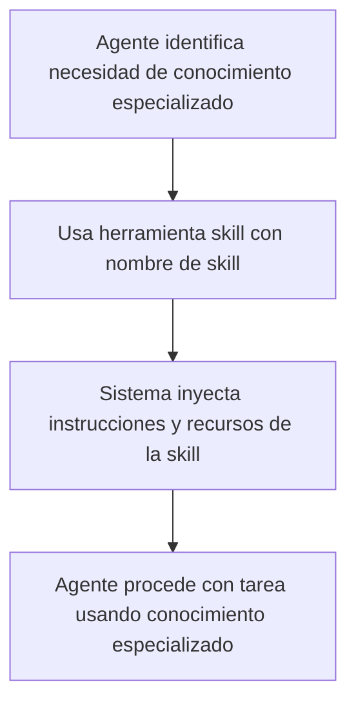

# Skills

> [!tip] Tiempo estimado de lectura
> 8-10 minutos

## Contenido
[[#Definición]]
[[#Características principales]]
[[#Cómo Funcionan las Skills]]
[[#Proceso de Carga]]
[[#Sintaxis]]
[[#Skills Disponibles en el Proyecto]]
[[#Cómo Invocar una Skill]]
[[#Ejemplos de Uso]]
[[#Relación con los Agentes]]
[[#Mejores Prácticas para el Uso de Skills]]
[[#Glosario de Términos]]
[[#Relación con Otros Conceptos del Sistema]]

---

## Definición

En el contexto de este sistema de agentes, una **Skill** es un módulo especializado que proporciona instrucciones, workflows y recursos específicos para realizar tareas particulares de manera más efectiva. Las skills extienden las capacidades básicas de los agentes al agregar conocimientos especializados, plantillas, scripts y mejores prácticas para dominios específicos.

> [!info] Características principales
> - **Modularidad**: Cada skill se enfoca en un dominio específico (ej: testing, diseño UI, documentación)
> - **Reutilización**: Las skills pueden ser invocadas por múltiples agentes para diferentes tareas
> - **Especialización**: Proporcionan conocimientos y herramientas específicas que mejoran la calidad del trabajo
> - **Integración**: Se cargan dinámicamente cuando se necesitan mediante la herramienta `skill`
> - **Recursos incluidos**: A menudo incluyen scripts, plantillas y referencias útiles

## Cómo Funcionan las Skills

Cuando un agente necesita realizar una tarea específica que requiere conocimientos especializados, puede cargar una skill usando la herramienta `skill`. Esto hace que las instrucciones, recursos y workflows de esa skill estén disponibles en el contexto actual del agente.

### Proceso de Carga



### Sintaxis

```bash
@skill nombre-de-la-skill
```

Algunas skills también aceptan parámetros adicionales, como archivos de esquema o nombres de módulos.

## Skills Disponibles en el Proyecto

El proyecto cuenta con una variedad de skills especializadas para diferentes dominios:

### 🛠️ Desarrollo y Programación
- [[javascript-typescript-jest]]: Best practices para escribir pruebas en JavaScript/TypeScript usando Jest
- [[next-best-practices]]: Convenciones y mejores prácticas para desarrollo en Next.js

### 🎨 Diseño y UI/UX
- [[frontend-design]]: Creación de interfaces frontend distintivas y de alta calidad
- [[ui-ux-pro-max]]: Inteligencia de diseño UI/UX para web y mobile con estilos, paletas, guías y más
- [[stitch-design]]: Trabajo unificado de diseño en Stitch (herramienta de diseño de Google Labs)
- [[stitch-design-taste]]: Sistema de diseño semántico para Google Stitch
- [[stitch-ui-design]]: Orientación experta para crear prompts efectivos en Google Stitch
- [[stitch-loop]]: Construcción iterativa de sitios web usando Stitch con patrón de bucle autónomo

### 📖 Documentación y Conocimiento
- [[obsidian-cli]]: Interacción con vaults de Obsidian usando CLI
- [[obsidian-markdown]]: Creación y edición de Markdown con sabor Obsidian
- [[obsidian-vault]]: Búsqueda, creación y gestión de notas en vaults de Obsidian
- [[obsidian-bases]]: Creación y edición de Bases de Obsidian (.base files)
- [[json-canvas]]: Creación y edición de archivos JSON Canvas (.canvas)

### 🔧 Herramientas y Utilidades
- [[defuddle]]: Extracción de contenido limpio de páginas web eliminando clutter y navegación
- [[find-skills]]: Descubrimiento e instalación de skills cuando los usuarios preguntan "cómo hacer X"
- [[remotion-best-practices]]: Mejores prácticas para creación de video en React usando Remotion

## Cómo Invocar una Skill

Los skills pueden ser invocados de dos maneras principales:

### 1. Como Agente Primario
```bash
@skill nombre-de-la-skill [parámetros]
```

### 2. Desde Otro Agente o Contexto
Cuando un agente necesita capacidades especializadas temporalmente, puede cargar una skill dentro de su flujo de trabajo actual.

## Ejemplos de Uso

### Crear un Módulo NestJS
```bash
@skill nestjs-module-generator nombre-del-modulo
```

### Escribir Mejores Pruebas Jest
```bash
@skill javascript-typescript-jest
```
Luego seguir las guías y patrones proporcionados para escribir pruebas efectivas.

### Diseñar una Interfaz UI/UX
```bash
@skill ui-ux-pro-max
```
Acceder a las 50+ estilos, 161 paletas de color, 57 pares de fuentes, etc.

### Extraer Contenido Limpio de una Web
```bash
@skill defuddle https://ejemplo.com/articulo
```
Obtener el contenido markdown limpio sin navegación, anuncios u otros elementos distractores.

## Relación con los Agentes

> [!note] Relación Skills-Agentes
> - Los **agentes** (como `@nest-developer`, `@next-developer`, `@doc-writer`) tienen especializaciones permanentes en ciertos dominios
> - Las **skills** proporcionan conocimientos especializados temporales que cualquier agente puede cargar cuando sea necesario
> - Esta combinación permite tanto especialización profunda como flexibilidad para abordar una amplia variedad de tareas

## Mejores Prácticas para el Uso de Skills

> [!tip] Selección Adecuada
> - Evalúa si la tarea requiere conocimientos especializados antes de cargar una skill
> - Elige la skill más específica posible para tu necesidad en lugar de una más general

> [!tip] Combinación de Skills
> - Para tareas complejas, puede ser beneficioso cargar múltiples skills secuencialmente
> - Ejemplo: Primero cargar `ui-ux-pro-max` para diseño, luego `frontend-design` para implementación

> [!tip] Aprovechar Recursos Incluidos
> - Muchas skills incluyen scripts, plantillas y referencias útiles
> - Revisa detenidamente la sección de recursos de cada skill para aprovechar al máximo su valor

> [!tip] Actualización y Mantenimiento
> - Las skills pueden actualizarse con nuevas mejores prácticas y recursos
> - Periódicamente revisa si hay skills nuevas o actualizadas que puedan beneficiar tu flujo de trabajo

## Glosario de Términos

- **[[skill]]**: Módulo especializado que proporciona instrucciones, workflows y recursos para tareas específicas
- **[[contexto]]**: El entorno de conocimiento actual del agente al que se añaden las instrucciones de la skill
- **Herramienta skill**: El mecanismo mediante el cual los agentes cargan skills especializadas
- **Recursos de skill**: Scripts, plantillas, referencias y otros materiales incluidos en una skill
- **Workflow**: Proceso paso a paso proporcionado por una skill para completar un tipo específico de tarea
- **Dominio especializado**: El área específica de conocimiento en la que se enfoca una skill (ej: testing, diseño, documentación)

## Relación con Otros Conceptos del Sistema

Este mecanismo de skills se relaciona con varios aspectos de nuestra arquitectura:

- [[agentes-especializados]] - Los agentes permanentes con especializaciones en dominios específicos
- [[herramientas-del-sistema]] - Las diversas herramientas disponibles para los agentes (skill, read, write, etc.)
- [[flujos-de-trabajo]] - Los procesos estandarizados para completar diferentes tipos de tareas
- [[mejoras-de-capacidad]] - Cómo el sistema extiende sus capacidades más allá del conocimiento básico
- [[especializacion-temporal]] - El concepto de agregar conocimientos especializados según sea necesario
- [[reutilizacion-de-conocimiento]] - Cómo el conocimiento especializado puede ser usado por múltiples agentes
- [[plantillas-y-scripts]] - Los recursos prácticos incluidos en muchas skills para acelerar el trabajo

> [!note] Documento creado siguiendo las mejores prácticas de Obsidian Flavored Markdown
> *Última actualización: 2026-04-27*