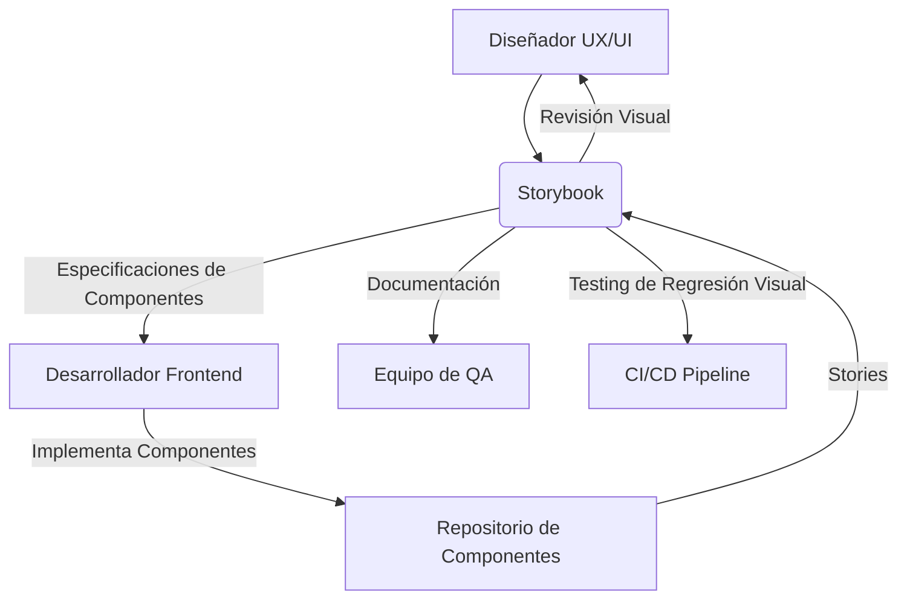

# Storybook

## Definición

**Storybook** es una herramienta de código abierto para desarrollar componentes de interfaz de usuario (UI) de forma aislada. Permite construir, probar y documentar componentes de UI de manera eficiente, facilitando la colaboración entre diseñadores y desarrolladores, y asegurando la consistencia visual y funcional de la aplicación.

> [!info] Características principales
> -   **Desarrollo Aislado**: Permite trabajar en componentes sin preocuparse por la lógica de negocio o el estado de la aplicación.
> -   **Galería de Componentes**: Crea una biblioteca interactiva de componentes de UI, mostrando sus diferentes estados y variaciones.
> -   **Documentación Viva**: Genera documentación automáticamente a partir de las "stories" de los componentes, manteniéndola siempre actualizada.
> -   **Testing Visual y de Interacción**: Facilita la revisión visual y la prueba de interacciones de los componentes.
> -   **Addons Extensibles**: Amplia funcionalidad a través de una gran variedad de addons (ej. para accesibilidad, diseño, testing).
> -   **Soporte Multi-Framework**: Compatible con React, Vue, Angular, Web Components, Svelte, y más.

## Uso en el Sistema de Ticketera

En nuestro proyecto, Storybook se utiliza principalmente para el desarrollo y la documentación de los componentes de UI del frontend [[Next.js]]. Esto incluye elementos como botones, formularios, tarjetas de eventos, selectores de fecha, etc.

### Arquitectura de Integración

### Flujo de Trabajo con Storybook

1.  **Diseño**: El equipo de diseño define la apariencia y el comportamiento de los componentes.
2.  **Desarrollo**: Los desarrolladores implementan los componentes en [[Next.js]] y crean "stories" en Storybook para cada estado y variación.
3.  **Revisión**: Diseñadores, desarrolladores y stakeholders revisan los componentes en Storybook, proporcionando feedback.
4.  **Testing**: Se utilizan addons de Storybook para pruebas de accesibilidad, interacción y regresión visual.
5.  **Documentación**: Storybook sirve como la fuente de verdad para la documentación de los componentes, accesible para todo el equipo.

## Beneficios para el Proyecto

### [!success] Consistencia y Calidad de UI
-   **Diseño Unificado**: Asegura que todos los componentes sigan las guías de diseño y la identidad visual del proyecto.
-   **Componentes Reutilizables**: Fomenta la creación de componentes modulares y reutilizables, acelerando el desarrollo.
-   **Detección Temprana de Errores**: Permite identificar problemas visuales o de comportamiento en los componentes de forma aislada.

### [!success] Colaboración Mejorada
-   **Lenguaje Común**: Proporciona una plataforma compartida para que diseñadores, desarrolladores y QA colaboren eficazmente.
-   **Feedback Rápido**: Facilita la revisión y el feedback sobre los componentes sin necesidad de desplegar la aplicación completa.
-   **Onboarding Acelerado**: Nuevos miembros del equipo pueden explorar y entender rápidamente todos los componentes disponibles.

### [!success] Eficiencia en el Desarrollo
-   **Desarrollo Aislado**: Los desarrolladores pueden enfocarse en un componente a la vez, sin distracciones.
-   **Pruebas Simplificadas**: Facilita la escritura de pruebas unitarias y visuales para los componentes.
-   **Documentación Automática**: Reduce el esfuerzo manual de mantener la documentación de UI actualizada.

## Integración con Otros Servicios

-   **[[Next.js]]**: Framework principal para el desarrollo del frontend.
-   **[[MCP]]**: Storybook puede ser expuesto como un [[Servidor MCP]] local, permitiendo a los agentes de IA interactuar con los componentes de UI.
-   **[[Agentes-especializados]]**: Un `@ux-ui-developer` podría usar Storybook para generar o modificar componentes.
-   **[[CI-CD]]**: Integración en pipelines para pruebas de regresión visual automatizadas.
-   **[[Sentry]]**: Para monitorear errores que puedan ocurrir durante la interacción con los componentes en Storybook (aunque menos común que en la aplicación real).

## Mejores Prácticas de Implementación

### [!tip] Organización de Stories
-   Organizar las stories de forma lógica (ej. por categoría, por página, por Atomic Design).
-   Crear una story para cada estado y variación significativa de un componente.

### [!tip] Uso de Addons
-   **Addon Controls**: Para ajustar props de componentes de forma interactiva.
-   **Addon Actions**: Para registrar eventos disparados por los componentes.
-   **Addon Accessibility**: Para verificar el cumplimiento de estándares de accesibilidad.
-   **Addon Docs**: Para generar documentación rica automáticamente.

### [!tip] Pruebas Automatizadas
-   Integrar pruebas de regresión visual (ej. con Chromatic, Storybook Test Runner) en el pipeline de CI/CD.
-   Escribir pruebas de interacción para asegurar el comportamiento correcto de los componentes.

### [!tip] Colaboración
-   Compartir el Storybook desplegado con todo el equipo y stakeholders.
-   Fomentar el feedback directo en las stories.

## Glosario de Términos

-   **Story**: Una "historia" es una función que describe cómo renderizar un componente en un estado particular.
-   **Addon**: Extensiones que añaden funcionalidades a Storybook (ej. controles, acciones, accesibilidad).
-   **Canvas**: El área donde se renderiza el componente en Storybook.
-   **Controls**: Un addon que permite a los usuarios interactuar con las props de un componente en tiempo real.
-   **DocsPage**: Una página de documentación generada automáticamente para cada componente.
-   **Args**: Argumentos que se pasan a una story para controlar las props del componente.
-   **Chromatic**: Una herramienta de pruebas de regresión visual que se integra con Storybook.

## Relación con Otros Conceptos del Sistema

- [[Next.js]] - Framework principal del frontend donde se usan los componentes.
- [[Atomic Design]] - Metodología de diseño que se alinea bien con el desarrollo de componentes en Storybook.
- [[UX/UI Design]] - Herramienta clave para la implementación y validación del diseño.
- [[Calidad-de-Código]] - Contribuye a la calidad al facilitar el testing y la consistencia.
- [[Documentación-de-proyecto]] - Sirve como documentación viva de los componentes de UI.

> [!note] Documento creado siguiendo las mejores prácticas de Obsidian Flavored Markdown
> *Última actualización: 2026-04-27*