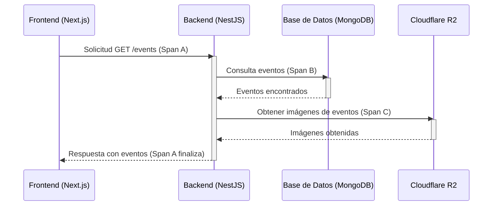

# Tracing Distribuido

## Definición

El **Tracing Distribuido** es una técnica de observabilidad que permite seguir el camino de una solicitud o transacción a medida que atraviesa múltiples servicios y componentes en un sistema distribuido. Proporciona una vista completa del flujo de ejecución, mostrando la latencia y los errores en cada paso, lo que es crucial para diagnosticar problemas en arquitecturas de microservicios.

## Conceptos Clave

-   **Trace**: Representa una solicitud completa o una unidad de trabajo a medida que se propaga a través de un sistema. Un trace se compone de múltiples spans.
-   **Span**: Una operación individual dentro de un trace. Cada span representa una unidad lógica de trabajo con un nombre, un tiempo de inicio, una duración y metadatos (tags, logs). Los spans pueden tener relaciones padre-hijo.
-   **Contexto de Trace**: Información que se propaga entre servicios para correlacionar los spans. Típicamente incluye el ID del trace y el ID del span padre.

## Importancia en el Proyecto

En nuestro sistema de ticketera, que potencialmente utiliza una [[Arquitectura-de-microservicios|arquitectura de microservicios]], el tracing distribuido es esencial para:

-   **Diagnóstico de Latencia**: Identificar qué servicio o componente está causando un cuello de botella en una solicitud.
-   **Análisis de Errores**: Rastrear la causa raíz de un error a través de múltiples servicios.
-   **Comprensión del Flujo**: Visualizar cómo interactúan los servicios para cumplir una solicitud del usuario.
-   **Optimización del Rendimiento**: Obtener información detallada para optimizar la comunicación y el procesamiento entre servicios.

## Implementación

Utilizamos [[Sentry]] para implementar el tracing distribuido en nuestro sistema. Sentry SDKs instrumentan automáticamente las solicitudes HTTP y otras operaciones, generando traces y spans que se envían a la plataforma de Sentry para su visualización y análisis.

### Ejemplo de Trace

## Relación con Otros Conceptos

- [[Observabilidad]] - El tracing es uno de los pilares de la observabilidad.
- [[APM]] - Application Performance Monitoring, que incluye el tracing distribuido.
- [[Sentry]] - Nuestra herramienta para implementar tracing.
- [[Arquitectura-de-microservicios]] - El tracing es crucial para la depuración en este tipo de arquitectura.
- [[NestJS]] / [[Next.js]] - Frameworks donde se instrumenta el tracing.

> [!note] Documento creado como placeholder.
> *Última actualización: 2026-04-27*