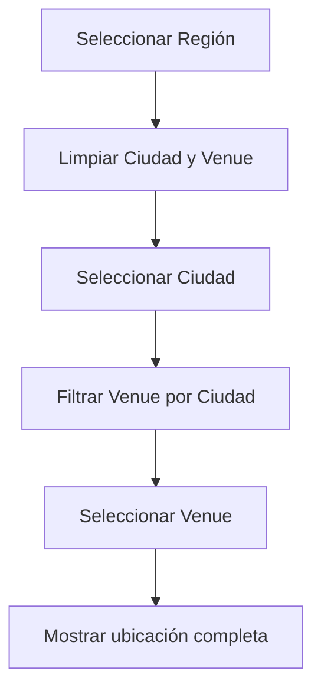
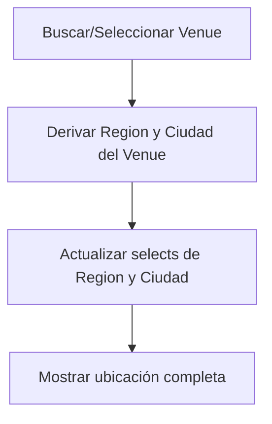
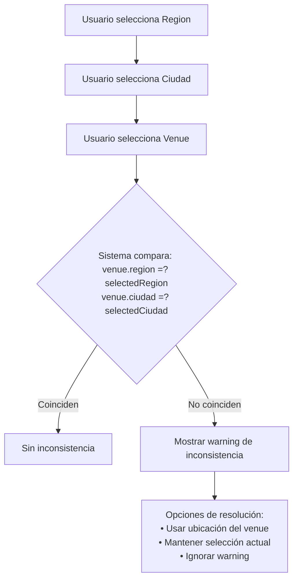

---

# Venue (Recinto/Espacio)

> [!info] Definición
> Un **Venue** representa un lugar físico donde se llevan a cabo eventos, con información específica de ubicación que incluye nombre, dirección, región y ciudad. Es un concepto fundamental en el sistema de ticketera que conecta la experiencia del usuario con la logística de los eventos.

## Modelo de Datos

### Interfaz TypeScript

```typescript
interface Venue {
  id: string;              // Identificador único (ObjectId)
  nombre: string;          // Nombre del recinto (ej: "Teatro Municipal")
  direccion: string;       // Dirección literal (ej: "Av. Libertador 1234")
  region: string;          // Región obligatoria (derivable desde ciudad)
  ciudad: string;         // Ciudad/Comuna obligatoria (derivable desde region)
}
```

### Características de los Campos

| Campo | Tipo | Obligatorio | Fuente | Descripción |
|-------|------|-------------|--------|-------------|
| `id` | `string` | Sí | Sistema | Identificador único (ObjectId) |
| `nombre` | `string` | Sí | Usuario | Nombre libre del recinto |
| `direccion` | `string` | Sí | Usuario | Dirección libre |
| `region` | `string` | Sí | `COMUNAS_CHILE` | derivable desde ciudad |
| `ciudad` | `string` | Sí | `COMUNAS_CHILE` | derivable desde region |

> [!tip] Nota de Implementación
> - `region` + `ciudad` son obligatorios pero derivables entre sí mediante los datos estáticos de `COMUNAS_CHILE`
> - `direccion` es libre (ingreso manual del usuario)
> - `nombre` es libre (ingreso manual del usuario)

## Flujos de Usuario

El sistema soporta dos flujos principales para la selección de ubicación:

### Flujo A: Selección Jerárquica
Usuario selecciona en orden: **Región → Ciudad → Venue**



### Flujo B: Venue Directo
Usuario busca/selecciona Venue directamente, y el sistema deriva automáticamente Region y Ciudad.



> [!IMPORTANT] Regla Fundamental
> **Ciudad → Región es automático** (derivado de `COMUNAS_CHILE`)
> No existe "Flujo Ciudad sin Región" porque siempre se conoce la región de cualquier ciudad en Chile.

## Lógica de Cascada Bidireccional

El sistema mantiene consistencia entre las selecciones de Region, Ciudad y Venue mediante detección y resolución de inconsistencias.

### Matriz de Acciones

| Acción del Usuario | Region | Ciudad | Venue | Inconsistencia |
|-------------------|--------|--------|-------|-----------------|
| Seleccionar Región | Se actualiza | Se limpia | Se limpia | Se detecta |
| Seleccionar Ciudad | Se deriva | Se actualiza | Se limpia | Se detecta |
| Seleccionar Venue | Se deriva | Se deriva | Se actualiza | Se detecta |
| Limpiar Venue | Sin cambio | Sin cambio | Se limpia | Se resuelve |
| Crear Nuevo Venue | Requerido | Requerido | Creado | N/A |

### Detección de Inconsistencias

Cuando se selecciona un Venue pero la Region/Ciudad seleccionada no coincide con la ubicación del Venue:



## Componentes Principales

### Hook: useVenueSelector

Hook personalizado que maneja la lógica bidireccional de selección de ubicación.

**Responsabilidades:**
- Manejo de estado interno (region, ciudad, venue)
- Filtrado de venues según selecciones
- Detección de inconsistencias
- Notificación de cambios vía callbacks
- Persistencia de estado

### Componente: VenueSelector

Componente UI que implementa la selección de ubicación con:
- Dropdowns para Región y Ciudad
- Búsqueda de Venue
- Visualización de venue seleccionado
- Manejo de warnings de inconsistencia
- Estados de carga y error

## Servicio Backend (NestJS)

### Endpoints REST

#### GET /api/venues
Lista todos los venues con filtros opcionales.

```typescript
// Request (Query Parameters)
interface GetVenuesRequest {
  region?: string;      // Filtrar por región
  ciudad?: string;      // Filtrar por ciudad
  search?: string;      // Búsqueda por nombre o dirección
  limit?: number;       // Límite de resultados (default: 50)
  offset?: number;      // Offset para paginación
}

// Response
interface GetVenuesResponse {
  data: Venue[];
  total: number;
  limit: number;
  offset: number;
}
```

**Ejemplos de uso:**
```bash
GET /api/venues?region=Metropolitana&search=teatro
GET /api/venues?ciudad=Santiago&limit=20
```

#### GET /api/venues/:id
Obtiene un venue por ID.

#### POST /api/venues
Crea un nuevo venue.

#### PUT /api/venues/:id
Actualiza un venue existente.

#### DELETE /api/venues/:id
Elimina un venue.

### Schema de Base de Datos

```typescript
// venue.schema.ts
import { Prop, Schema, SchemaFactory } from '@nestjs/mongoose';
import { Document } from 'mongoose';

export type VenueDocument = Venue & Document;

@Schema({ timestamps: true })
export class Venue {
  @Prop({ required: true })
  nombre: string;

  @Prop({ required: true })
  direccion: string;

  @Prop({ required: true })
  region: string;

  @Prop({ required: true })
  ciudad: string;
}

export const VenueSchema = SchemaFactory.createForClass(Venue);

// Índices para búsqueda eficiente
VenueSchema.index({ region: 1, ciudad: 1 });
VenueSchema.index({ nombre: 'text', direccion: 'text' });
```

> [!tip] Notas de Implementación
> - **Venue**: Se consulta desde base de datos (datos dinámicos)
> - **Region/Ciudad**: Datos estáticos de configuración (no se crean frecuentemente)
> - **Creación de venue**: Región y ciudad son obligatorios
> - **Búsqueda**: Puede ser por nombre o dirección
> - **Índices**: Crear índices en los campos de filtro frecuentes

## Display Unificado

### Función de Display

```typescript
/**
 * Genera una representación de texto unificada para ubicación
 * @param venue - Venue seleccionado (opcional)
 * @param region - Región seleccionada (opcional)
 * @param ciudad - Ciudad seleccionada (opcional)
 * @returns String formateado para display
 */
const getLocationDisplay = (
  venue?: Venue,
  region?: string,
  ciudad?: string
): string => {
  if (venue) {
    return `📍 ${venue.direccion}, ${venue.nombre}, ${ciudad || '...'}, ${region || '...'}`;
  }
  
  if (ciudad || region) {
    return `📍 ${ciudad || '...'}, ${region || '...'}`;
  }
  
  return '📍 Selecciona ubicación';
};
```

### Variantes de Display

| Escenario | Output |
|-----------|--------|
| Venue completo | `📍 Av. Libertador 1234, Teatro Municipal, Santiago, Metropolitana` |
| Solo ciudad | `📍 Santiago, Metropolitana` |
| Solo región | `📍 ..., Metropolitana` |
| Nada seleccionado | `📍 Selecciona ubicación` |

## Validación y Manejo de Errores

### Detección de Inconsistencias

Algoritmo que compara la ubicación del venue con la selección actual:

```typescript
function detectarInconsistencia(
  venue: Venue,
  selectedRegion?: string,
  selectedCiudad?: string
): Inconsistencia | null {
  if (!selectedRegion && !selectedCiudad) {
    return null; // Sin inconsistencia si no hay selección previa
  }
  
  if (selectedRegion && venue.region !== selectedRegion) {
    return {
      tipo: 'venue_no_match_region',
      mensaje: `El venue "${venue.nombre}" está en ${venue.region}, pero seleccionaste ${selectedRegion}`,
      venue,
      venueLocation: { region: venue.region, ciudad: venue.ciudad },
      selectedLocation: { region: selectedRegion, ciudad: selectedCiudad || '' },
    };
  }
  
  if (selectedCiudad && venue.ciudad !== selectedCiudad) {
    return {
      tipo: 'venue_no_match_ciudad',
      mensaje: `El venue "${venue.nombre}" está en ${venue.ciudad}, pero seleccionaste ${selectedCiudad}`,
      venue,
      venueLocation: { region: venue.region, ciudad: venue.ciudad },
      selectedLocation: { region: selectedRegion || '', ciudad: selectedCiudad },
    };
  }
  
  return null;
}
```

### Opciones de Resolución

| Opción | Acción | Resultado |
|--------|--------|-----------|
| **Usar ubicación del venue** | `handleApplyVenueLocation` | Actualiza Region/Ciudad a los del venue |
| **Mantener selección actual** | `handleKeepCurrentLocation` | Deja inconsistente, guarda solo venue |
| **Ignorar warning** | `handleDismissWarning` | Cierra el warning sin cambios |

## Dependencias

### Frontend

- `useVenueSelector` - Hook de lógica bidireccional
- `VenueSelector` - Componente UI principal
- `RegionSelector` / `CiudadSelector` - Dropdowns de selección
- `VenueCard` - Componente para mostrar venue seleccionado
- `InconsistenciaWarning` - Componente de warning
- `useVenueService` - Hook para consumo de API
- `COMUNAS_CHILE` - Datos estáticos de ubicaciones

### Backend

- `VenueModule` - Módulo NestJS principal
- `VenueController` - Endpoints REST
- `VenueService` - Lógica de negocio
- `Venue` - Entity/Schema de Mongoose
- `VenueRepository` - Acceso a datos

### Datos Estáticos

```typescript
// COMUNAS_CHILE.ts
export const REGIONES_CHILE = [
  'Arica y Parinacota',
  'Tarapacá',
  'Antofagasta',
  'Atacama',
  'Coquimbo',
  'Valparaíso',
  'Metropolitana',
  'O\'Higgins',
  'Maule',
  'Ñuble',
  'Biobío',
  'La Araucanía',
  'Los Ríos',
  'Los Lagos',
  'Aysén',
  'Magallanes',
] as const;

export type Region = typeof REGIONES_CHILE[number];

export const CIUDADES_POR_REGION: Record<Region, string[]> = {
  'Metropolitana': ['Santiago', 'Providencia', 'Las Condes', 'Ñuñoa', 'Maipú', 'La Florida', ...],
  'Valparaíso': ['Valparaíso', 'Viña del Mar', 'Reñaca', 'Concón', 'Quilpué', ...],
  // ... otras regiones
};
```

## Consideraciones de Rendimiento

### Optimizaciones Recomendadas

1. **Memoización de filtros**: `useMemo` para `filteredVenues`
2. **Debounce en búsqueda**: Esperar 300ms antes de filtrar
3. **Virtualización**: Para listas largas de venues (>100 items)
4. **Caché de regiones/ciudades**: No recargar datos estáticos

```typescript
// Ejemplo de optimización con useMemo
const filteredVenues = useMemo(() => {
  return venues.filter(venue => {
    const matchRegion = !region || venue.region === region;
    const matchCiudad = !ciudad || venue.ciudad === ciudad;
    const matchSearch = !search || 
      venue.nombre.toLowerCase().includes(search.toLowerCase()) ||
      venue.direccion.toLowerCase().includes(search.toLowerCase());
    return matchRegion && matchCiudad && matchSearch;
  });
}, [venues, region, ciudad, search]);
```

## Relación con Otros Conceptos

Este módulo de Venue está estrechamente relacionado con:
- [[Entradas y E-Tickets]] - Los venues son donde se utilizan las entradas
- [[Gestión de Eventos]] - Los eventos se asocian a específicos venues
- [[Taxonomía-de-eventos]] - Clasificación de tipos de eventos por venue
- [[Producto MVP]] - Parte del producto mínimo viable
- [[API REST - Especificación]] - Detalles de los endpoints implementados
- [[COMUNAS_CHILE]] - Datos estáticos de regiones y ciudades de Chile

## Mejores Prácticas

### Para Desarrolladores

> [!tip] Siempre validar la consistencia entre venue y región/ciudad antes de guardar
> [!tip] Usar el hook `useVenueSelector` en lugar de manejar el estado manualmente
> [!tip] Implementar debounce en búsquedas de venue para mejorar rendimiento
> [!tip] Aprovechar los índices de MongoDB en region y ciudad para consultas eficientes

### Para Diseñadores de UI

> [!tip] Mostrar claramente las opciones de resolución cuando se detecta inconsistencia
> [!tip] Usar indicadores visuales de carga durante las búsquedas de venue
> [!tip] Proveer feedback inmediato al seleccionar un venue (mostrar ubicación completa)
> [!tip] Considerar accesibilidad en todos los componentes de selección

## Glosario de Términos

- **Venue**: Recinto o espacio físico donde se realizan eventos
- **Inconsistencia**: Estado cuando la ubicación seleccionada (region/ciudad) no coincide con la del venue
- **Derivación automática**: Proceso donde seleccionar un venue actualiza automáticamente region y ciudad
- **COMUNAS_CHILE**: Conjunto de datos estáticos que relacionan regiones y ciudades de Chile
- **Hook useVenueSelector**: Hook personalizado que encapsula toda la lógica de selección de ubicación
- **Display unificado**: Función que genera una representación de texto consistente para la ubicación
- **Cascada bidireccional**: Mecanismo que mantiene consistencia entre region, ciudad y venue en ambas direcciones

---

*Documento basado en: doc/definiciones/venue-diseno.md*
*Última actualización: 2024-01-15*